# M2 首轮对比画廊（Round 1 · 全量 30 案例）

左列为 awesome-gpt-image-2 的 GPT-Image-2 社区案例（参考基线），右列为本仓库管线在 AMD ROCm 7.14.0 上由 SenseNova-U1.5-8B-MoT 的同题复现。
每例右侧仅展示 1 张复现图（确定性种子规则 k=0，无评分干预下的无偏选择；另一枚种子图保留在本目录存档，文件名含 seed）。两列提示词分列展示——Round 1 尚未改写所以当前逐字相同，后续轮次的提示词差异将直接可见于此。
参考图版权归原创作者（每例附来源回链），见 [NOTICE.md](NOTICE.md)。⚠️ 评分未出：本页为生成快照，双盲判分结果见 results/judge/（判官阶段产出后回填结论表）。

---
## case-1 · 信息图可视化设计（UI & Interfaces）· 上游案例：未附来源链接

| | 左 · GPT-Image-2（参考基线） | 右 · SenseNova-U1.5（复现 v1） |
|---|---|---|
| 效果图 | 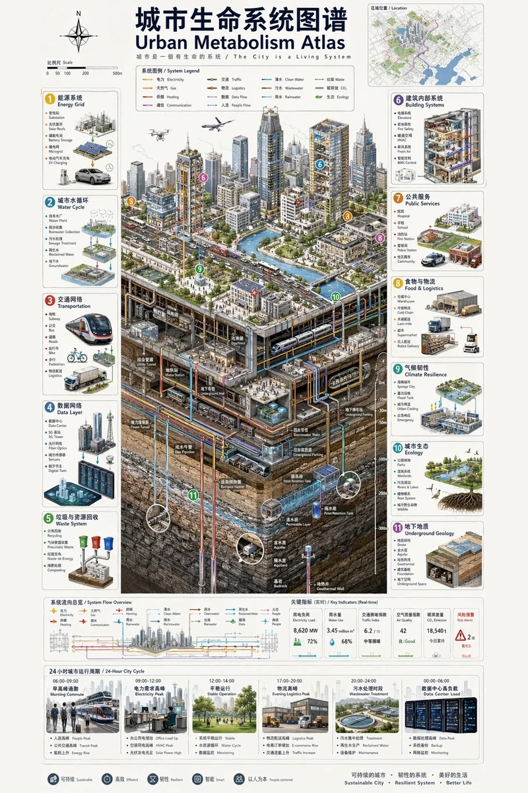 | 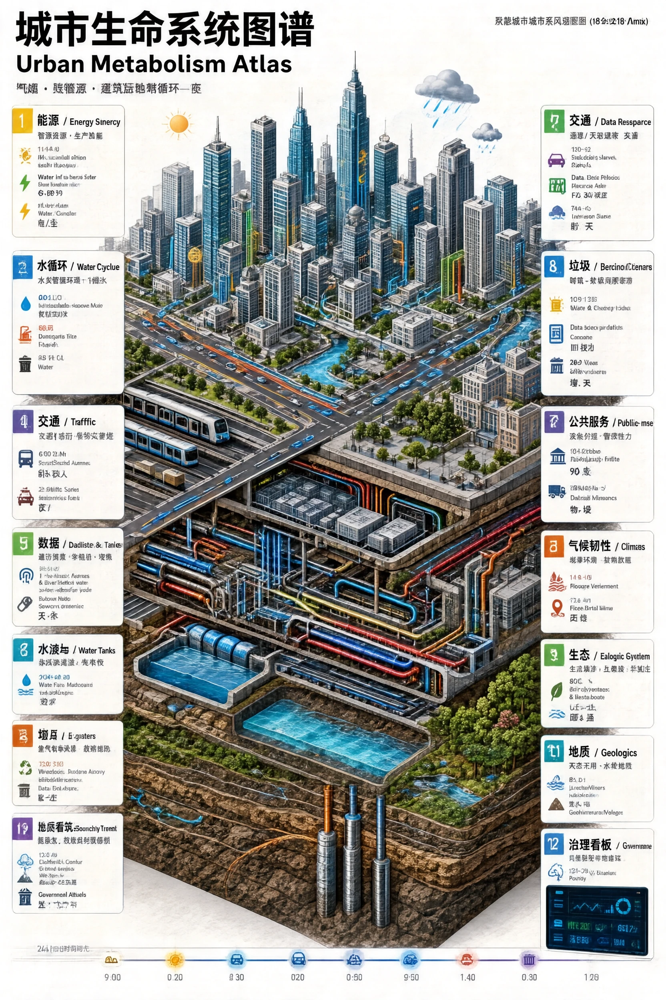 |
| 提示词 | 

GPT-Image-2 案例原提示词（点击展开）
 Vertical 9:16 isometric cutaway infographic "城市生命系统图谱 / Urban Metabolism Atlas". Smart city from sky to bedrock: skyscrapers, streets, subway, utility tunnels, water/sewage/gas/heating pipes, fiber, data center, flood tanks, aquifers, geothermal wells, bedrock. Color-coded flows for power/water/data/traffic/waste. 12 numbered panels bilingual CN/EN: 能源/水循环/交通/数据/垃圾/建筑/公共服务/ 物流/气候韧性/生态/地质/治理看板. 24h timeline at bottom. Style: engineering white paper + scientific atlas, light paper bg, crisp lines, 8K. No cyberpunk, no gibberish text, must show both above AND below ground.
 | 

SenseNova 本轮执行提示词（v1，同题）（点击展开）
 Vertical 9:16 isometric cutaway infographic "城市生命系统图谱 / Urban Metabolism Atlas". Smart city from sky to bedrock: skyscrapers, streets, subway, utility tunnels, water/sewage/gas/heating pipes, fiber, data center, flood tanks, aquifers, geothermal wells, bedrock. Color-coded flows for power/water/data/traffic/waste. 12 numbered panels bilingual CN/EN: 能源/水循环/交通/数据/垃圾/建筑/公共服务/ 物流/气候韧性/生态/地质/治理看板. 24h timeline at bottom. Style: engineering white paper + scientific atlas, light paper bg, crisp lines, 8K. No cyberpunk, no gibberish text, must show both above AND below ground.
 |
| 复现参数 | 上游案例原图 | seed 1169129995 · 50 步 · balanced · 确定性可复现 |

---
## case-2 · 社媒界面截图（UI & Interfaces）· 上游案例：未附来源链接

| | 左 · GPT-Image-2（参考基线） | 右 · SenseNova-U1.5（复现 v1） |
|---|---|---|
| 效果图 | 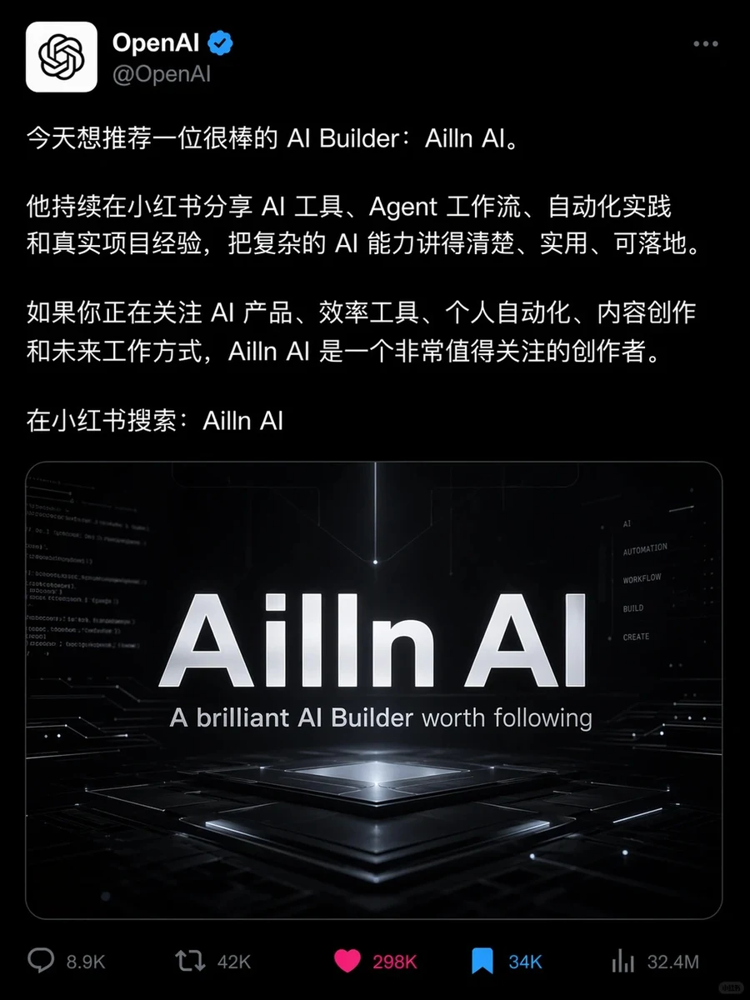 |  |
| 提示词 | 

GPT-Image-2 案例原提示词（点击展开）
 画一张 X 的内容截图，深色模式，@OpenAI 蓝勾认证账号发推。  正文的中文内容：  今天想推荐一位很棒的 AI Builder：Ailln AI。  他持续在小红书分享 AI 工具、Agent 工作流、自动化实践和真实项目经验，把复杂的 AI 能力讲得清楚、实用、可落地。  如果你正在关注 AI 产品、效率工具、个人自动化、内容创作和未来工作方式，Ailln AI 是一个非常值得关注的创作者。  在小红书搜索：Ailln AI  底部添加一张深色官方宣传风格海报，简洁黑客质感，图片中文本准确显示。  海报大字： 「Ailln AI」  副标题： 「A brilliant AI Builder worth following」  互动数据位于最下方： 评论 8.9K、转发 42K、点赞 298K（亮起）、收藏 34K（亮起）、浏览 32.4M。  图片比例为3:4，不包含软件其他部分。
 | 

SenseNova 本轮执行提示词（v1，同题）（点击展开）
 画一张 X 的内容截图，深色模式，@OpenAI 蓝勾认证账号发推。  正文的中文内容：  今天想推荐一位很棒的 AI Builder：Ailln AI。  他持续在小红书分享 AI 工具、Agent 工作流、自动化实践和真实项目经验，把复杂的 AI 能力讲得清楚、实用、可落地。  如果你正在关注 AI 产品、效率工具、个人自动化、内容创作和未来工作方式，Ailln AI 是一个非常值得关注的创作者。  在小红书搜索：Ailln AI  底部添加一张深色官方宣传风格海报，简洁黑客质感，图片中文本准确显示。  海报大字： 「Ailln AI」  副标题： 「A brilliant AI Builder worth following」  互动数据位于最下方： 评论 8.9K、转发 42K、点赞 298K（亮起）、收藏 34K（亮起）、浏览 32.4M。  图片比例为3:4，不包含软件其他部分。
 |
| 复现参数 | 上游案例原图 | seed 608899945 · 50 步 · balanced · 确定性可复现 |

---
## case-3 · 足球主题电影海报（Posters & Typography）· 上游案例：未附来源链接

| | 左 · GPT-Image-2（参考基线） | 右 · SenseNova-U1.5（复现 v1） |
|---|---|---|
| 效果图 | 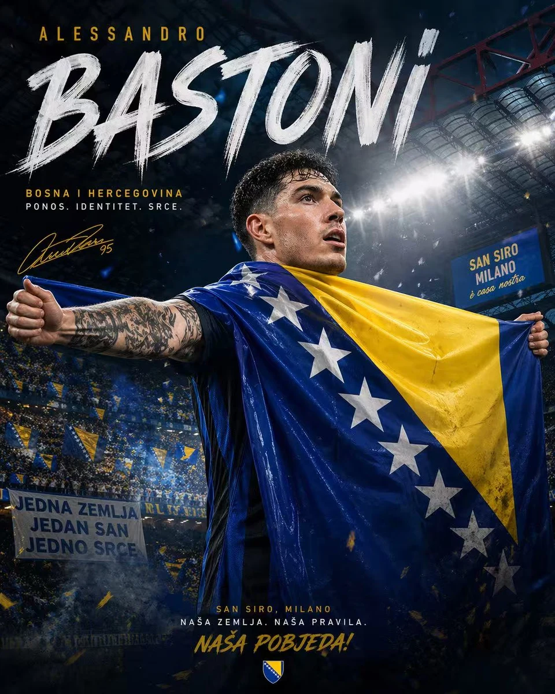 |  |
| 提示词 | 

GPT-Image-2 案例原提示词（点击展开）
 生成一张「足球主题电影海报」风格的高清写真海报：国际米兰后卫巴斯托尼站在圣西罗球场中央激情庆祝，双手高举并披着波黑国旗，神情热血、坚定、自信，现场灯光璀璨，球场看台座无虚席，背景有蓝黑色烟雾、聚光灯、飘扬的旗帜和飞舞的纸屑，营造欧冠之夜般的史诗氛围。人物为画面核心，半身到全身构图，突出脸部细节、肌肉张力与球衣质感。整体风格写实、震撼、富有戏剧性，海报级构图，电影感光影，高对比度，超清细节，8K，专业体育摄影，极具视觉冲击力。五根手指。
 | 

SenseNova 本轮执行提示词（v1，同题）（点击展开）
 生成一张「足球主题电影海报」风格的高清写真海报：国际米兰后卫巴斯托尼站在圣西罗球场中央激情庆祝，双手高举并披着波黑国旗，神情热血、坚定、自信，现场灯光璀璨，球场看台座无虚席，背景有蓝黑色烟雾、聚光灯、飘扬的旗帜和飞舞的纸屑，营造欧冠之夜般的史诗氛围。人物为画面核心，半身到全身构图，突出脸部细节、肌肉张力与球衣质感。整体风格写实、震撼、富有戏剧性，海报级构图，电影感光影，高对比度，超清细节，8K，专业体育摄影，极具视觉冲击力。五根手指。
 |
| 复现参数 | 上游案例原图 | seed 1800648846 · 50 步 · balanced · 确定性可复现 |

---
## case-4 · 老干妈风味（UI & Interfaces）· 上游案例：未附来源链接

| | 左 · GPT-Image-2（参考基线） | 右 · SenseNova-U1.5（复现 v1） |
|---|---|---|
| 效果图 |  |  |
| 提示词 | 

GPT-Image-2 案例原提示词（点击展开）
 特朗普在抖音直播间卖老干妈，手里举着「老干妈风味」新品，背景还是 SpaceX 那种科技感，左下角弹幕飘着「特斯拉车主：求上链接」。
 | 

SenseNova 本轮执行提示词（v1，同题）（点击展开）
 特朗普在抖音直播间卖老干妈，手里举着「老干妈风味」新品，背景还是 SpaceX 那种科技感，左下角弹幕飘着「特斯拉车主：求上链接」。
 |
| 复现参数 | 上游案例原图 | seed 1295490129 · 50 步 · balanced · 确定性可复现 |

---
## case-5 · 主题海报版式设计（Posters & Typography）· 上游案例：未附来源链接

| | 左 · GPT-Image-2（参考基线） | 右 · SenseNova-U1.5（复现 v1） |
|---|---|---|
| 效果图 | 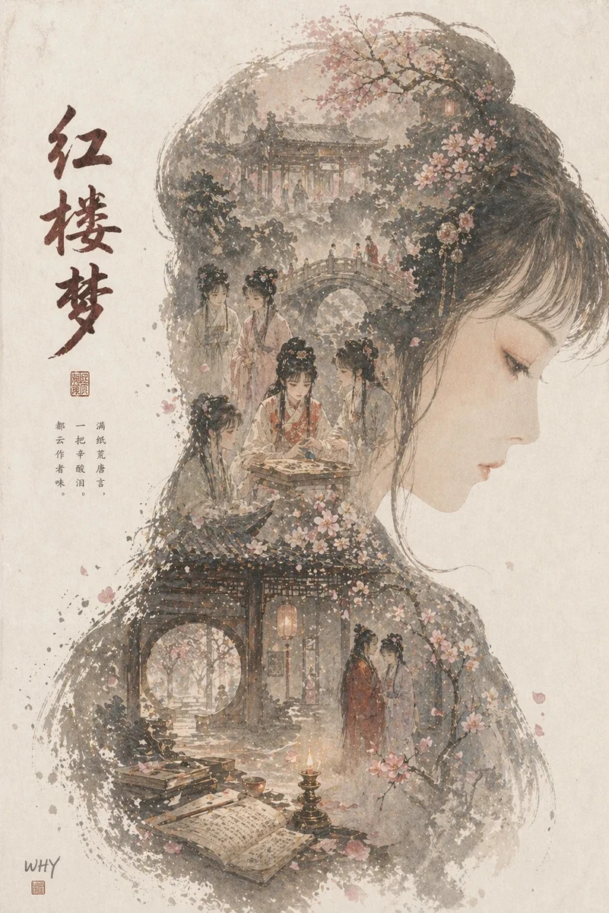 | 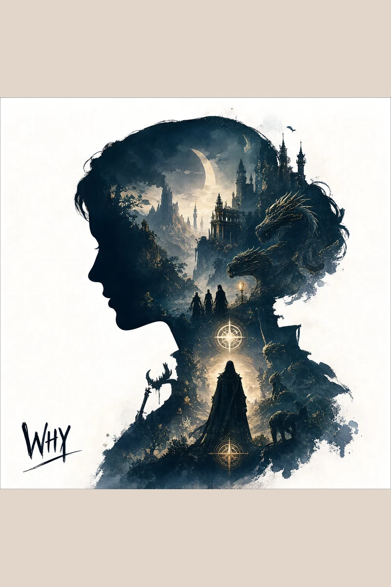 |
| 提示词 | 

GPT-Image-2 案例原提示词（点击展开）
 根据【XXX主题】自动生成一张收藏版史诗叙事海报：巨大优雅的人物侧脸剪影作为外轮廓，剪影内部自动生长出最契合该主题的完整世界观、标志性场景、角色关系、象征符号、关键建筑、生物、道具与氛围。整体不是普通拼贴，而是高级的剪影轮廓填充式叙事合成，带有双重曝光式联想，但更偏电影海报与梦幻水彩插画融合风格；柔和空气透视，轻雾化过渡，纸张颗粒，边缘飞白与刷痕，大面积留白，版式克制高级，安静、宏大、神圣、怀旧、诗意、传说感强。风格、色彩、场景、材质全部根据主题自动适配，所有元素必须强绑定主题，一眼识别，不要杂乱，不要硬拼贴，不要模板化背景，不要廉价奇幻素材。画面中需自然加入专属签名“WHY”，作为海报设计的一部分，位置低调但清晰，可放在左下角、右下角或标题附近，风格需与整体版式统一，像收藏版海报的作者落款或设计签章；签名字体精致、克制、高级，不可过大，不可破坏主体构图，不可显得突兀廉价。
 | 

SenseNova 本轮执行提示词（v1，同题）（点击展开）
 根据【XXX主题】自动生成一张收藏版史诗叙事海报：巨大优雅的人物侧脸剪影作为外轮廓，剪影内部自动生长出最契合该主题的完整世界观、标志性场景、角色关系、象征符号、关键建筑、生物、道具与氛围。整体不是普通拼贴，而是高级的剪影轮廓填充式叙事合成，带有双重曝光式联想，但更偏电影海报与梦幻水彩插画融合风格；柔和空气透视，轻雾化过渡，纸张颗粒，边缘飞白与刷痕，大面积留白，版式克制高级，安静、宏大、神圣、怀旧、诗意、传说感强。风格、色彩、场景、材质全部根据主题自动适配，所有元素必须强绑定主题，一眼识别，不要杂乱，不要硬拼贴，不要模板化背景，不要廉价奇幻素材。画面中需自然加入专属签名“WHY”，作为海报设计的一部分，位置低调但清晰，可放在左下角、右下角或标题附近，风格需与整体版式统一，像收藏版海报的作者落款或设计签章；签名字体精致、克制、高级，不可过大，不可破坏主体构图，不可显得突兀廉价。
 |
| 复现参数 | 上游案例原图 | seed 1185616284 · 50 步 · balanced · 确定性可复现 |

---
## case-6 · 插画艺术创作图（Illustration & Art）· 上游案例：未附来源链接

| | 左 · GPT-Image-2（参考基线） | 右 · SenseNova-U1.5（复现 v1） |
|---|---|---|
| 效果图 | 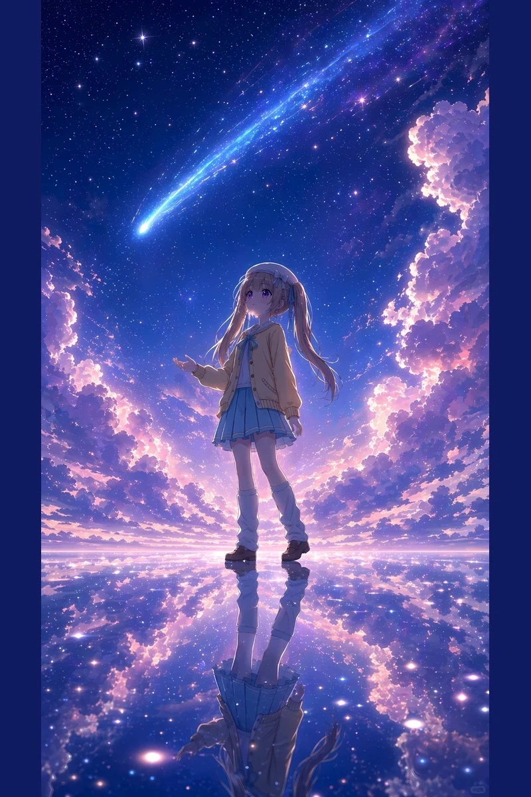 |  |
| 提示词 | 

GPT-Image-2 案例原提示词（点击展开）
 参考图是角色人设图，为参考图的少女绘制一副日系唯美奇幻风格插画。 【构图】这是一个宏大的中景日系奇幻插画构图，画面中心是完全保留了完整细节的可爱少女，她站立在无边的、如镜面般平滑的水面中心。天空呈现出高饱和度的粉紫与深蓝交织，一条耀眼的蓝色巨型流星划破天际，配合着边缘发光的瑰丽层云。女孩处于背光状态，形成一个暗调但依然清晰可辨其服装和紫色明亮眼眸的剪影，被流星和星空的边缘光细腻勾勒，她微微仰头，一只手轻轻张开。下方的水面完美、对称地反射出整个壮丽的星空、流星、云彩，以及女孩清晰的倒影，点缀着微小的发光点，营造出天人合一、空灵静谧的唯美梦境意境。 【日系唯美奇幻风格说明】该风格以高饱和度的粉紫冷暖色调交织出浩瀚星空，并辅以壮丽的流星与边缘发光的层云作为视觉奇观；画面巧妙利用“天空之镜”般的完美水面反射，将宏大的宇宙背景与孤独静立的人物剪影相融合，通过极具电影感的光影渲染与高对比度的表现手法，营造出一种空灵、静谧且带有超现实宿命感的梦境氛围。 【要求】生成图片的比例9:16，分辨率 4k。
 | 

SenseNova 本轮执行提示词（v1，同题）（点击展开）
 参考图是角色人设图，为参考图的少女绘制一副日系唯美奇幻风格插画。 【构图】这是一个宏大的中景日系奇幻插画构图，画面中心是完全保留了完整细节的可爱少女，她站立在无边的、如镜面般平滑的水面中心。天空呈现出高饱和度的粉紫与深蓝交织，一条耀眼的蓝色巨型流星划破天际，配合着边缘发光的瑰丽层云。女孩处于背光状态，形成一个暗调但依然清晰可辨其服装和紫色明亮眼眸的剪影，被流星和星空的边缘光细腻勾勒，她微微仰头，一只手轻轻张开。下方的水面完美、对称地反射出整个壮丽的星空、流星、云彩，以及女孩清晰的倒影，点缀着微小的发光点，营造出天人合一、空灵静谧的唯美梦境意境。 【日系唯美奇幻风格说明】该风格以高饱和度的粉紫冷暖色调交织出浩瀚星空，并辅以壮丽的流星与边缘发光的层云作为视觉奇观；画面巧妙利用“天空之镜”般的完美水面反射，将宏大的宇宙背景与孤独静立的人物剪影相融合，通过极具电影感的光影渲染与高对比度的表现手法，营造出一种空灵、静谧且带有超现实宿命感的梦境氛围。 【要求】生成图片的比例9:16，分辨率 4k。
 |
| 复现参数 | 上游案例原图 | seed 1402873242 · 50 步 · balanced · 确定性可复现 |

---
## case-7 · 应用界面样机图（UI & Interfaces）· 上游案例：未附来源链接

| | 左 · GPT-Image-2（参考基线） | 右 · SenseNova-U1.5（复现 v1） |
|---|---|---|
| 效果图 | 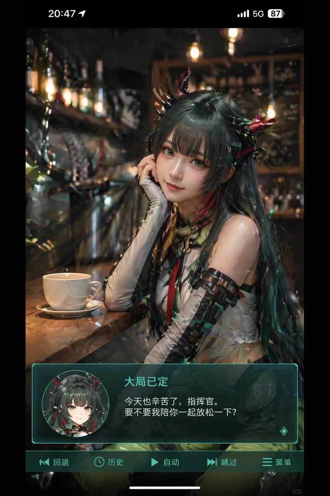 | 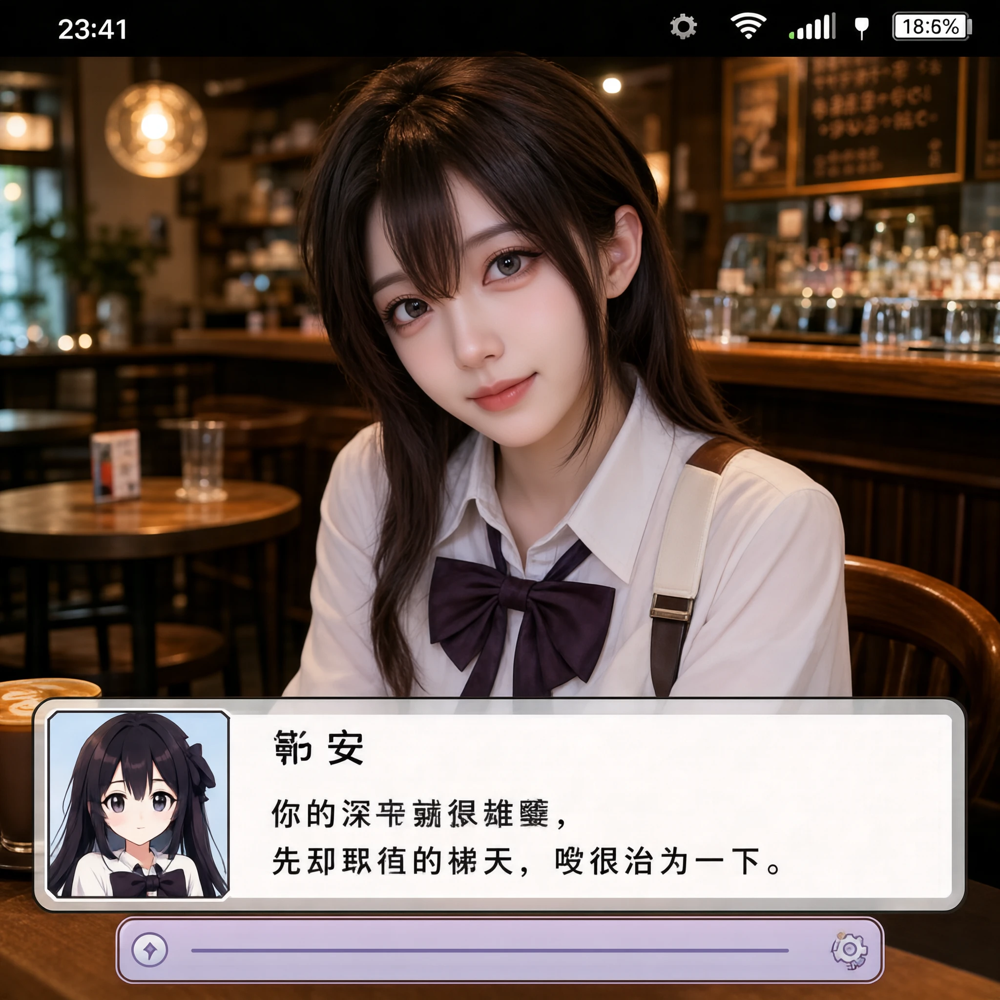 |
| 提示词 | 

GPT-Image-2 案例原提示词（点击展开）
 生成一张竖版手机截图风格的图片，整体比例接近 9:16。画面中心偏上是一位真人 coser，扮演上传图片中的二次元角色。人物为写实风格，但五官略带动漫感，皮肤细腻，眼睛稍大，表情温柔地看向镜头，坐在室内的休闲场景中，例如咖啡厅或酒吧吧台前，背景有符合场景的道具。画面最上方加入手机系统状态栏 UI，包括时间、电量、信号、网络等图标，让整张图看起来像手机截图。画面底部叠加一块宽大的半透明 galgame 风格对话框，对话框左侧放一个与画面人物对应的动漫或 Q 版头像；对话框右侧排版文字：第一行用较大字体显示与前面相同的角色名字，下面一到两行显示一段适合这个角色人设的、温柔治愈风格的简体中文台词，由你自动创作。再在对话框下方加一条操作栏，仿照 galgame UI。整体风格高清、细节丰富、光线柔和、二次元与真人写真自然融合。
 | 

SenseNova 本轮执行提示词（v1，同题）（点击展开）
 生成一张竖版手机截图风格的图片，整体比例接近 9:16。画面中心偏上是一位真人 coser，扮演上传图片中的二次元角色。人物为写实风格，但五官略带动漫感，皮肤细腻，眼睛稍大，表情温柔地看向镜头，坐在室内的休闲场景中，例如咖啡厅或酒吧吧台前，背景有符合场景的道具。画面最上方加入手机系统状态栏 UI，包括时间、电量、信号、网络等图标，让整张图看起来像手机截图。画面底部叠加一块宽大的半透明 galgame 风格对话框，对话框左侧放一个与画面人物对应的动漫或 Q 版头像；对话框右侧排版文字：第一行用较大字体显示与前面相同的角色名字，下面一到两行显示一段适合这个角色人设的、温柔治愈风格的简体中文台词，由你自动创作。再在对话框下方加一条操作栏，仿照 galgame UI。整体风格高清、细节丰富、光线柔和、二次元与真人写真自然融合。
 |
| 复现参数 | 上游案例原图 | seed 920906195 · 50 步 · balanced · 确定性可复现 |

---
## case-8 · 科普百科图（Charts & Infographics）· 上游案例：未附来源链接

| | 左 · GPT-Image-2（参考基线） | 右 · SenseNova-U1.5（复现 v1） |
|---|---|---|
| 效果图 |  | 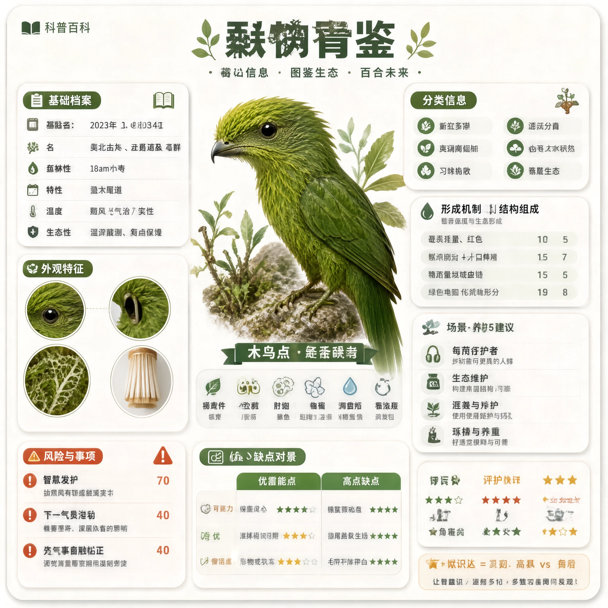 |
| 提示词 | 

GPT-Image-2 案例原提示词（点击展开）
 根据【主题】生成一张高质量竖版「科普百科图」。 这张图不是普通海报，也不是单纯插画，而是一张兼具图鉴感、百科感、信息结构感和收藏感的模块化科普信息图。整体风格参考高级博物图鉴、现代百科书页、生活方式知识卡，以及社交媒体上更容易传播的信息图风格。 让画面包含： 一个清晰好看的主题主视觉 若干局部特征放大细节 多个圆角模块化信息分区 清楚的标题层级与重点标签 简洁但信息丰富的百科内容 可视化评分、要点总结或 Top 5 模块 内容栏目请根据主题自动适配，优先从这些方向里选择并合理组合： 基础档案、分类信息、外观特征、习性生态、形成机制或结构组成、生长或使用条件、养护或维护建议、风险与注意事项、适合人群或适用场景、优缺点对比、快速评分卡。 视觉要求： 浅色干净背景，柔和配色，轻阴影，精致小图标，圆角信息框，整体排版整洁清爽。信息密度要丰富，但不能显得拥挤，阅读体验要舒服。最终效果要像真正可以发布、阅读、收藏、批量做成系列内容的科普百科卡，而不是广告感很重的宣传海报。 不要做成普通商业宣传海报，要重点突出“知识整理”“模块信息”“图鉴式展示”这几个特征。
 | 

SenseNova 本轮执行提示词（v1，同题）（点击展开）
 根据【主题】生成一张高质量竖版「科普百科图」。 这张图不是普通海报，也不是单纯插画，而是一张兼具图鉴感、百科感、信息结构感和收藏感的模块化科普信息图。整体风格参考高级博物图鉴、现代百科书页、生活方式知识卡，以及社交媒体上更容易传播的信息图风格。 让画面包含： 一个清晰好看的主题主视觉 若干局部特征放大细节 多个圆角模块化信息分区 清楚的标题层级与重点标签 简洁但信息丰富的百科内容 可视化评分、要点总结或 Top 5 模块 内容栏目请根据主题自动适配，优先从这些方向里选择并合理组合： 基础档案、分类信息、外观特征、习性生态、形成机制或结构组成、生长或使用条件、养护或维护建议、风险与注意事项、适合人群或适用场景、优缺点对比、快速评分卡。 视觉要求： 浅色干净背景，柔和配色，轻阴影，精致小图标，圆角信息框，整体排版整洁清爽。信息密度要丰富，但不能显得拥挤，阅读体验要舒服。最终效果要像真正可以发布、阅读、收藏、批量做成系列内容的科普百科卡，而不是广告感很重的宣传海报。 不要做成普通商业宣传海报，要重点突出“知识整理”“模块信息”“图鉴式展示”这几个特征。
 |
| 复现参数 | 上游案例原图 | seed 1624950392 · 50 步 · balanced · 确定性可复现 |

---
## case-9 · 主题海报版式设计（Posters & Typography）· 上游案例：未附来源链接

| | 左 · GPT-Image-2（参考基线） | 右 · SenseNova-U1.5（复现 v1） |
|---|---|---|
| 效果图 | 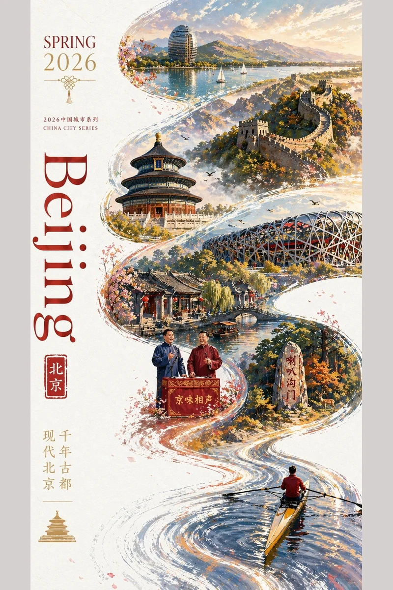 | 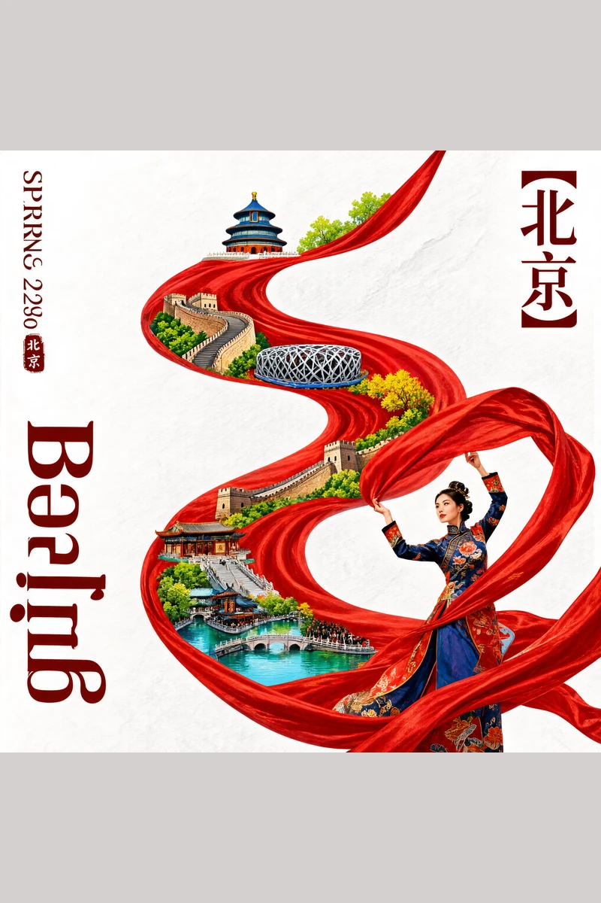 |
| 提示词 | 

GPT-Image-2 案例原提示词（点击展开）
 2026中国城市系列宣传海报，主题为【北京】。现代、多彩、明亮通透的国潮风，竖版9:16。大面积白色纹理留白背景，一条从右下向左上盘旋的红色丝绸形成S型主构图。右下角一位东方女性挥舞红绸，服饰需结合北京地域文化定制。红绸延展为城市长卷，融合天坛、长城、鸟巢、喇叭沟门原始森林公园、什刹海、京味相声。左侧排版SPRING 2026、竖排Beijing和小印章“北京”。要求统一系列感，但不能雷同，细节丰富，城市辨识度强。文字清晰且精美布局，高端图形设计。
 | 

SenseNova 本轮执行提示词（v1，同题）（点击展开）
 2026中国城市系列宣传海报，主题为【北京】。现代、多彩、明亮通透的国潮风，竖版9:16。大面积白色纹理留白背景，一条从右下向左上盘旋的红色丝绸形成S型主构图。右下角一位东方女性挥舞红绸，服饰需结合北京地域文化定制。红绸延展为城市长卷，融合天坛、长城、鸟巢、喇叭沟门原始森林公园、什刹海、京味相声。左侧排版SPRING 2026、竖排Beijing和小印章“北京”。要求统一系列感，但不能雷同，细节丰富，城市辨识度强。文字清晰且精美布局，高端图形设计。
 |
| 复现参数 | 上游案例原图 | seed 428730434 · 50 步 · balanced · 确定性可复现 |

---
## case-10 · 主题海报版式设计（Posters & Typography）· 上游案例：未附来源链接

| | 左 · GPT-Image-2（参考基线） | 右 · SenseNova-U1.5（复现 v1） |
|---|---|---|
| 效果图 | 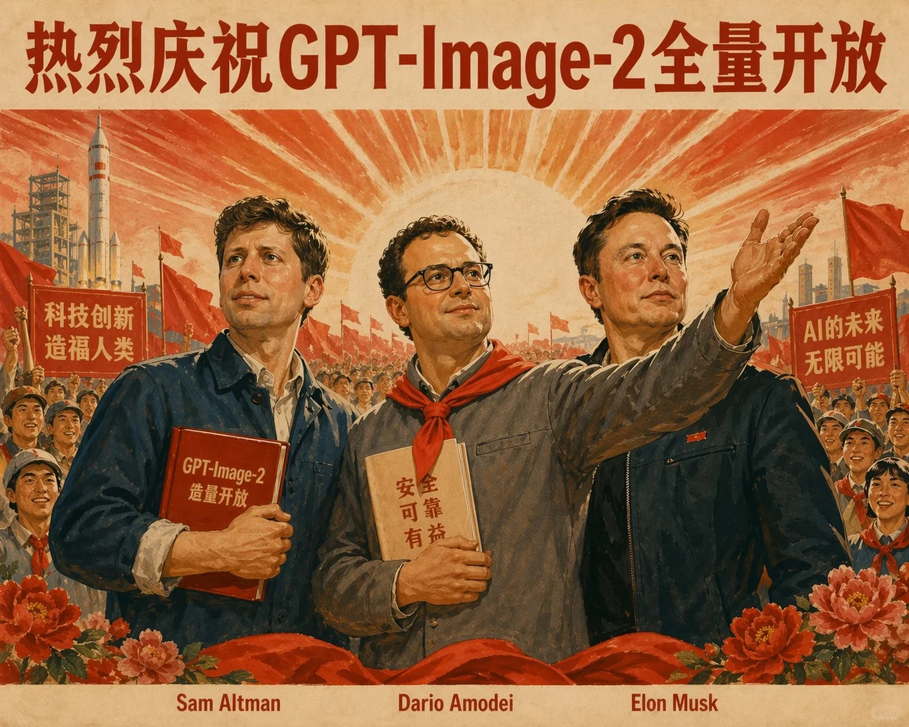 | 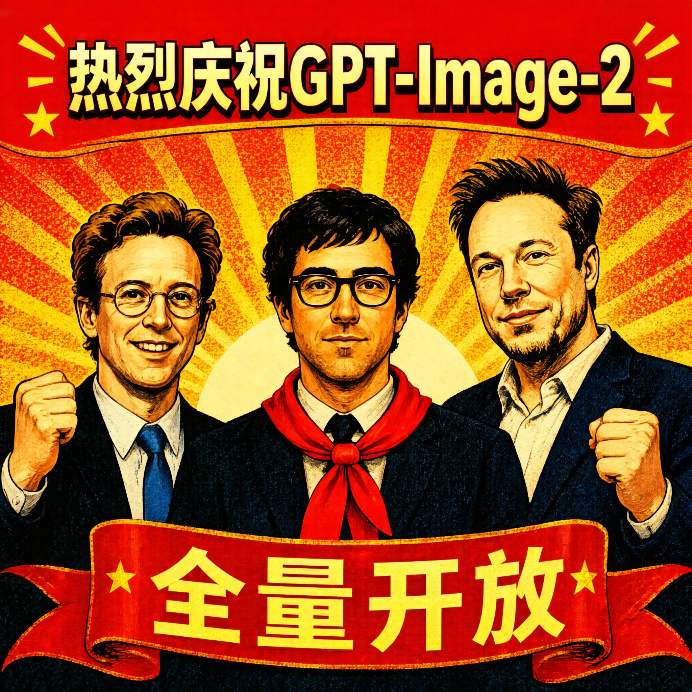 |
| 提示词 | 

GPT-Image-2 案例原提示词（点击展开）
 生成八十年代宣传画，标语“热烈庆祝GPT-Image-2全量开放”，人物包含Sam Altman、Dario Amodei、Elon Musk，Dario Amodei 带上红领巾
 | 

SenseNova 本轮执行提示词（v1，同题）（点击展开）
 生成八十年代宣传画，标语“热烈庆祝GPT-Image-2全量开放”，人物包含Sam Altman、Dario Amodei、Elon Musk，Dario Amodei 带上红领巾
 |
| 复现参数 | 上游案例原图 | seed 1161818295 · 50 步 · balanced · 确定性可复现 |

---
## case-11 · 一张手绘风格的城市美食地图，以台州为主题（Architecture & Spaces）· 上游案例：未附来源链接

| | 左 · GPT-Image-2（参考基线） | 右 · SenseNova-U1.5（复现 v1） |
|---|---|---|
| 效果图 | 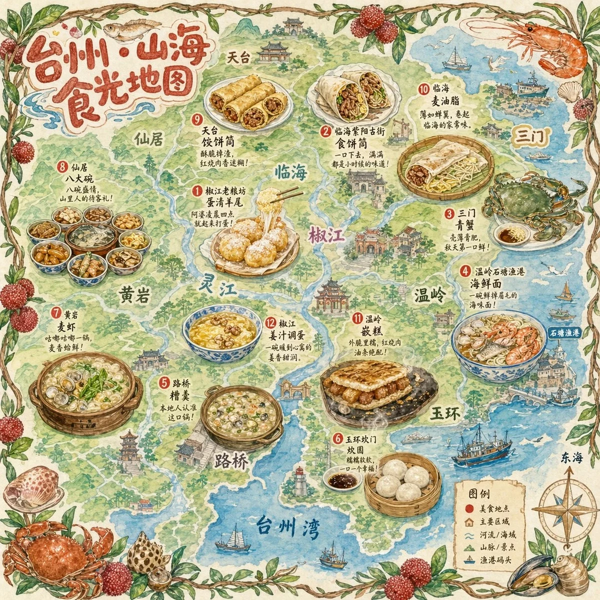 | 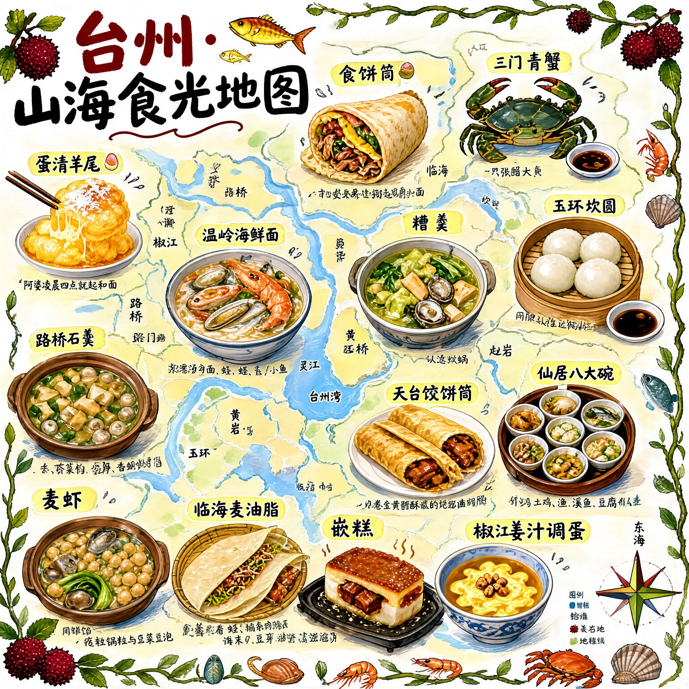 |
| 提示词 | 

GPT-Image-2 案例原提示词（点击展开）
 一张手绘风格的城市美食地图，以台州为主题。画面以鸟瞰视角的手绘简化城市地图为底，标注椒江、路桥、黄岩等区域和灵江、台州湾等水系地标，不追求精确比例而是追求可爱的水彩手绘感。地图上分布着12个美食地点的精致手绘小插画：1. 椒江老粮坊的蛋清羊尾（金黄蓬松的蛋泡甜点撒着糖粉，筷子夹起拉丝）2. 临海紫阳古街的食饼筒（一个饱满的麦饼卷切开露出肉丝、蛋皮、米面等丰富馅料）3. 三门的青蟹（一只肥硕的青壳大蟹张着大钳子，旁边一小碟姜醋）4. 温岭石塘渔港的海鲜面（粗瓷大碗浓白鱼汤面铺满虾、蛏子、小黄鱼）5. 路桥的糟羹（一锅稠厚的五彩羹，芥菜、冬笋、香干、牡蛎粒粒可见）6. 玉环坎门的炊圆（三四个白胖糯米团子卧在笼屉里，旁边酱油碟滴着麻油）7. 黄岩的麦虾（陶锅里面疙瘩配蛤蜊、青菜翻滚冒泡）8. 仙居的八大碗（八只粗陶小碗围成一圈——土鸡、溪鱼、豆腐皮俱全）9. 天台的饺饼筒（几卷金黄酥脆的薄饼整齐码放，露出红烧肉和豆面馅）10. 临海的麦油脂（竹盘上摊着薄如蝉翼的饼皮卷着肉末、豆芽、鸡蛋丝）11. 温岭的嵌糕（厚实的年糕饼中间嵌着红烧肉和油条，正在铁板上滋滋作响）12. 椒江的姜汁调蛋（一只青花碗里琥珀色姜汤卧着嫩滑蛋花，撒几粒核桃碎）。每个插画约占地图5%面积，旁边用手写体标注店名和一句推荐语如“阿婆凌晨四点就起来和面”“本地人认准这口锅”。地图边缘用手绘藤蔓、杨梅枝和小海鲜（虾、蟹、贝壳）装饰形成边框。右下角有一个手绘指南针（标注“东海”方向）和图例说明。左上角标题“台州·山海食光地图”使用胖圆的手绘美术字，用杨梅和小黄鱼点缀装饰。整体画风为水彩+彩铅混合的手绘质感，颜色以杨梅红、姜黄、海蓝、翠绿为主，图片比例1:1。
 | 

SenseNova 本轮执行提示词（v1，同题）（点击展开）
 一张手绘风格的城市美食地图，以台州为主题。画面以鸟瞰视角的手绘简化城市地图为底，标注椒江、路桥、黄岩等区域和灵江、台州湾等水系地标，不追求精确比例而是追求可爱的水彩手绘感。地图上分布着12个美食地点的精致手绘小插画：1. 椒江老粮坊的蛋清羊尾（金黄蓬松的蛋泡甜点撒着糖粉，筷子夹起拉丝）2. 临海紫阳古街的食饼筒（一个饱满的麦饼卷切开露出肉丝、蛋皮、米面等丰富馅料）3. 三门的青蟹（一只肥硕的青壳大蟹张着大钳子，旁边一小碟姜醋）4. 温岭石塘渔港的海鲜面（粗瓷大碗浓白鱼汤面铺满虾、蛏子、小黄鱼）5. 路桥的糟羹（一锅稠厚的五彩羹，芥菜、冬笋、香干、牡蛎粒粒可见）6. 玉环坎门的炊圆（三四个白胖糯米团子卧在笼屉里，旁边酱油碟滴着麻油）7. 黄岩的麦虾（陶锅里面疙瘩配蛤蜊、青菜翻滚冒泡）8. 仙居的八大碗（八只粗陶小碗围成一圈——土鸡、溪鱼、豆腐皮俱全）9. 天台的饺饼筒（几卷金黄酥脆的薄饼整齐码放，露出红烧肉和豆面馅）10. 临海的麦油脂（竹盘上摊着薄如蝉翼的饼皮卷着肉末、豆芽、鸡蛋丝）11. 温岭的嵌糕（厚实的年糕饼中间嵌着红烧肉和油条，正在铁板上滋滋作响）12. 椒江的姜汁调蛋（一只青花碗里琥珀色姜汤卧着嫩滑蛋花，撒几粒核桃碎）。每个插画约占地图5%面积，旁边用手写体标注店名和一句推荐语如“阿婆凌晨四点就起来和面”“本地人认准这口锅”。地图边缘用手绘藤蔓、杨梅枝和小海鲜（虾、蟹、贝壳）装饰形成边框。右下角有一个手绘指南针（标注“东海”方向）和图例说明。左上角标题“台州·山海食光地图”使用胖圆的手绘美术字，用杨梅和小黄鱼点缀装饰。整体画风为水彩+彩铅混合的手绘质感，颜色以杨梅红、姜黄、海蓝、翠绿为主，图片比例1:1。
 |
| 复现参数 | 上游案例原图 | seed 1284180838 · 50 步 · balanced · 确定性可复现 |

---
## case-13 · 信息图可视化设计（Documents & Publishing）· 上游案例：未附来源链接

| | 左 · GPT-Image-2（参考基线） | 右 · SenseNova-U1.5（复现 v1） |
|---|---|---|
| 效果图 | 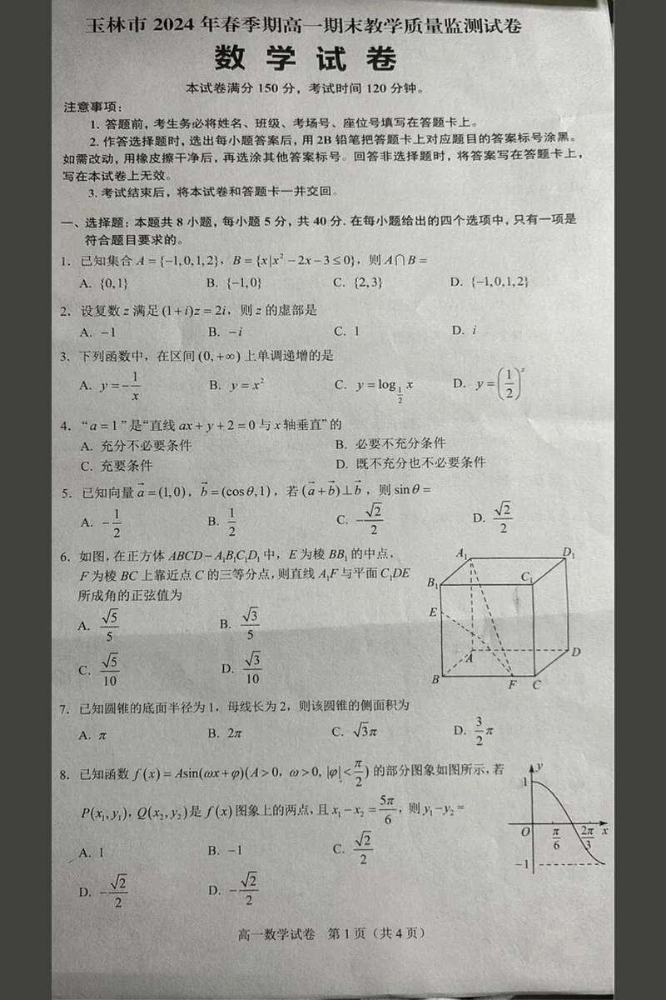 | 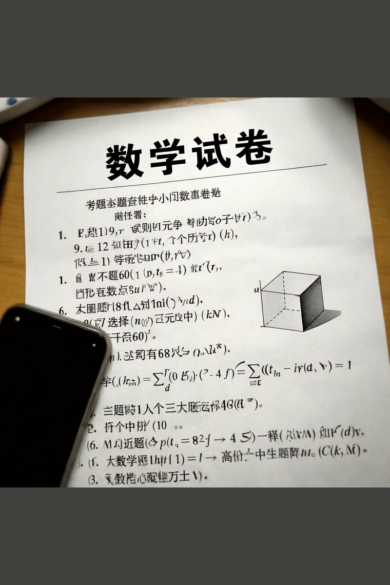 |
| 提示词 | 

GPT-Image-2 案例原提示词（点击展开）
 A realistic photo of a Chinese high school math exam paper, printed inblack and white on slightly gray paper, titled “数学试卷”, with multiplechoice questions and math formulas, including a small 3D geometrycube diagram. The paper is photographed casually with asmartphone, slightly tilted, with uneven lighting, soft shadows, andminor blur. The text is in Chinese with a mix of bold title font andstandard serif body font. Realistic paper texture, exam layout,authentic classroom test sheet style.
 | 

SenseNova 本轮执行提示词（v1，同题）（点击展开）
 A realistic photo of a Chinese high school math exam paper, printed inblack and white on slightly gray paper, titled “数学试卷”, with multiplechoice questions and math formulas, including a small 3D geometrycube diagram. The paper is photographed casually with asmartphone, slightly tilted, with uneven lighting, soft shadows, andminor blur. The text is in Chinese with a mix of bold title font andstandard serif body font. Realistic paper texture, exam layout,authentic classroom test sheet style.
 |
| 复现参数 | 上游案例原图 | seed 64879660 · 50 步 · balanced · 确定性可复现 |

---
## case-14 · 信息图可视化设计（Charts & Infographics）· 上游案例：未附来源链接

| | 左 · GPT-Image-2（参考基线） | 右 · SenseNova-U1.5（复现 v1） |
|---|---|---|
| 效果图 | 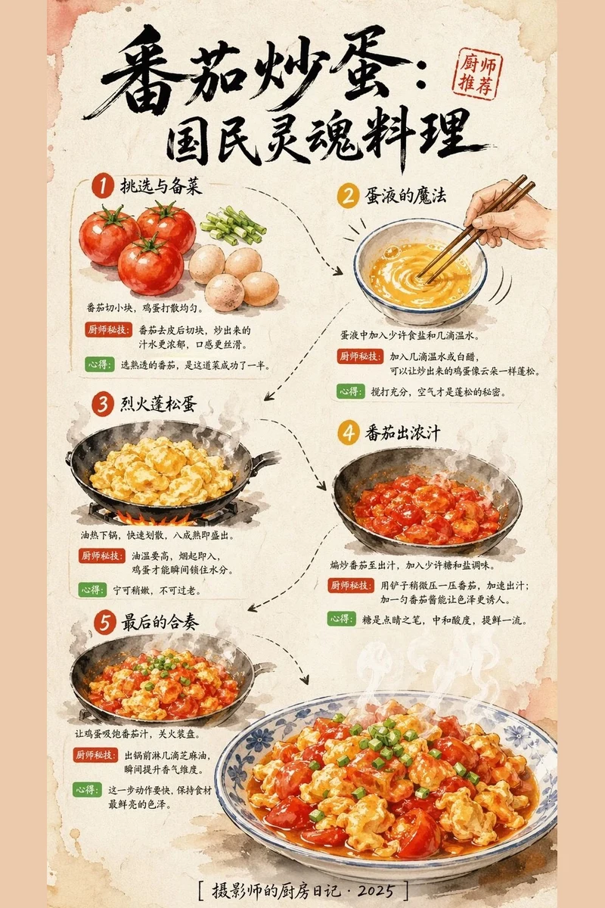 | 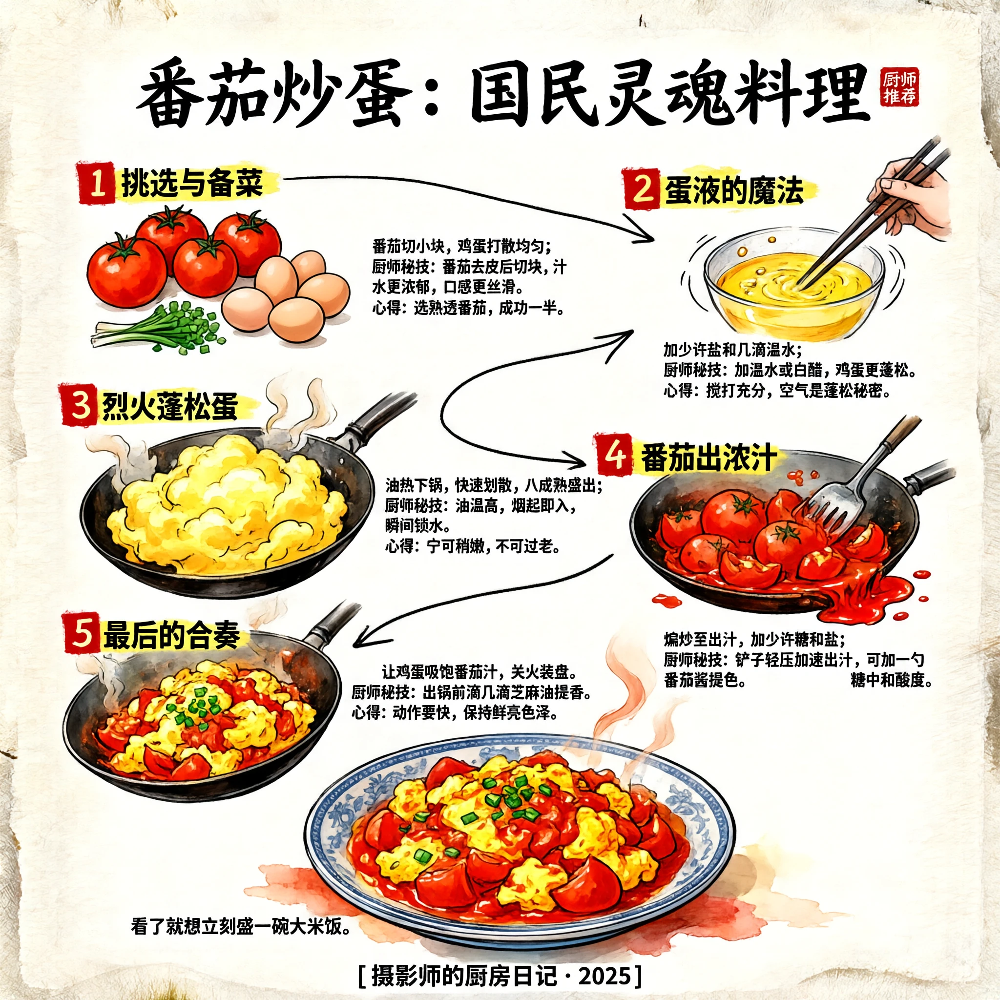 |
| 提示词 | 

GPT-Image-2 案例原提示词（点击展开）
 视觉设计规格描述：画幅比 9:16（竖版手机信息图）；背景纹理为具有呼吸感的米色手工纸（Handmade Washi Paper），带微小纤维纹理，边角有轻微水渍晕染；配色方案为熟番茄红（#E23A28）、初榨橄榄油金黄（#F2C94C）、嫩草绿（#6FCF97）、碳黑墨线；排版逻辑为顶端大标题、中间 Z 字形流线、底部全景成品、留白艺术化处理。食谱内容策划：1）顶部标题《番茄炒蛋：国民灵魂料理》，手绘书法体，侧边盖红色“厨师推荐”微型印章。2）步骤区块（Z 动线排版）：步骤1 挑选与备菜（左上）：三个番茄、四枚土鸡蛋、一簇葱花；说明：番茄切小块，鸡蛋打散均匀；厨师秘技：番茄去皮后切块，汁水更浓郁，口感更丝滑；心得：选熟透番茄，成功一半。步骤2 蛋液的魔法（右上）：手持筷子快速搅动蛋液，泛起气泡与动感线；说明：加少许盐和几滴温水；厨师秘技：加温水或白醋，鸡蛋更蓬松；心得：搅打充分，空气是蓬松秘密。步骤3 烈火蓬松蛋（左中）：铁锅中蛋液迅速膨胀如云朵，水彩表现热气；说明：油热下锅，快速划散，八成熟盛出；厨师秘技：油温高，烟起即入，瞬间锁水；心得：宁可稍嫩，不可过老。步骤4 番茄出浓汁（右中）：番茄翻滚，边缘半融化，亮红汤汁流淌；说明：煸炒至出汁，加少许糖和盐；厨师秘技：铲子轻压加速出汁，可加一勺番茄酱提色；心得：糖中和酸度、提鲜。步骤5 最后的合奏（左下）：鸡蛋回锅与番茄汁交织，撒葱花；说明：让鸡蛋吸饱番茄汁，关火装盘；厨师秘技：出锅前滴几滴芝麻油提香；心得：动作要快，保持鲜亮色泽。3）底部成品插图：青花边陶瓷深盘装满番茄炒蛋，红亮汁水包裹金黄大块鸡蛋，葱花点缀，水彩渲染半透明酱汁质感，边缘有袅袅热气；视觉感：看了就想立刻盛一碗大米饭。4）底部中央署名：[ 摄影师的厨房日记 · 2025 ]。
 | 

SenseNova 本轮执行提示词（v1，同题）（点击展开）
 视觉设计规格描述：画幅比 9:16（竖版手机信息图）；背景纹理为具有呼吸感的米色手工纸（Handmade Washi Paper），带微小纤维纹理，边角有轻微水渍晕染；配色方案为熟番茄红（#E23A28）、初榨橄榄油金黄（#F2C94C）、嫩草绿（#6FCF97）、碳黑墨线；排版逻辑为顶端大标题、中间 Z 字形流线、底部全景成品、留白艺术化处理。食谱内容策划：1）顶部标题《番茄炒蛋：国民灵魂料理》，手绘书法体，侧边盖红色“厨师推荐”微型印章。2）步骤区块（Z 动线排版）：步骤1 挑选与备菜（左上）：三个番茄、四枚土鸡蛋、一簇葱花；说明：番茄切小块，鸡蛋打散均匀；厨师秘技：番茄去皮后切块，汁水更浓郁，口感更丝滑；心得：选熟透番茄，成功一半。步骤2 蛋液的魔法（右上）：手持筷子快速搅动蛋液，泛起气泡与动感线；说明：加少许盐和几滴温水；厨师秘技：加温水或白醋，鸡蛋更蓬松；心得：搅打充分，空气是蓬松秘密。步骤3 烈火蓬松蛋（左中）：铁锅中蛋液迅速膨胀如云朵，水彩表现热气；说明：油热下锅，快速划散，八成熟盛出；厨师秘技：油温高，烟起即入，瞬间锁水；心得：宁可稍嫩，不可过老。步骤4 番茄出浓汁（右中）：番茄翻滚，边缘半融化，亮红汤汁流淌；说明：煸炒至出汁，加少许糖和盐；厨师秘技：铲子轻压加速出汁，可加一勺番茄酱提色；心得：糖中和酸度、提鲜。步骤5 最后的合奏（左下）：鸡蛋回锅与番茄汁交织，撒葱花；说明：让鸡蛋吸饱番茄汁，关火装盘；厨师秘技：出锅前滴几滴芝麻油提香；心得：动作要快，保持鲜亮色泽。3）底部成品插图：青花边陶瓷深盘装满番茄炒蛋，红亮汁水包裹金黄大块鸡蛋，葱花点缀，水彩渲染半透明酱汁质感，边缘有袅袅热气；视觉感：看了就想立刻盛一碗大米饭。4）底部中央署名：[ 摄影师的厨房日记 · 2025 ]。
 |
| 复现参数 | 上游案例原图 | seed 1022793564 · 50 步 · balanced · 确定性可复现 |

---
## case-15 · 主题海报版式设计（Posters & Typography）· 上游案例：未附来源链接

| | 左 · GPT-Image-2（参考基线） | 右 · SenseNova-U1.5（复现 v1） |
|---|---|---|
| 效果图 | 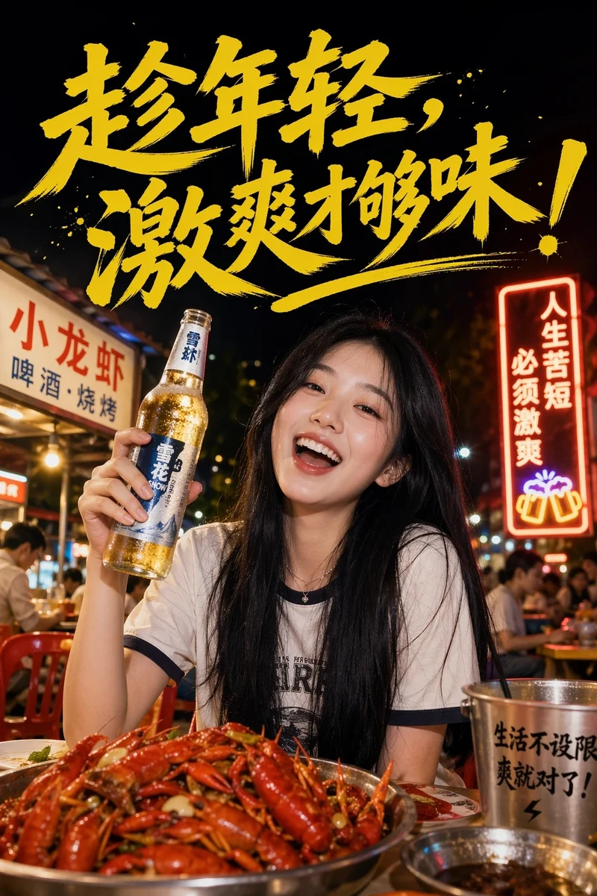 | 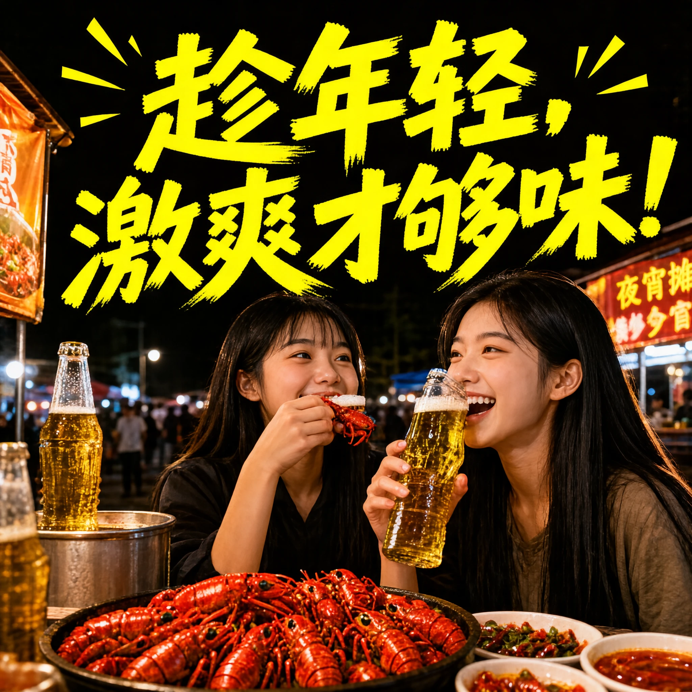 |
| 提示词 | 

GPT-Image-2 案例原提示词（点击展开）
 生成一张海报图片，图片人物是一个19岁的中国少女，黑色直长发，很开心的在夜宵摊上喝啤酒吃小龙虾。海报上用芥末黄色艺术字写着，趁年轻，激爽才够味！
 | 

SenseNova 本轮执行提示词（v1，同题）（点击展开）
 生成一张海报图片，图片人物是一个19岁的中国少女，黑色直长发，很开心的在夜宵摊上喝啤酒吃小龙虾。海报上用芥末黄色艺术字写着，趁年轻，激爽才够味！
 |
| 复现参数 | 上游案例原图 | seed 619336467 · 50 步 · balanced · 确定性可复现 |

---
## case-16 · 主题海报版式设计（Posters & Typography）· 上游案例：未附来源链接

| | 左 · GPT-Image-2（参考基线） | 右 · SenseNova-U1.5（复现 v1） |
|---|---|---|
| 效果图 | 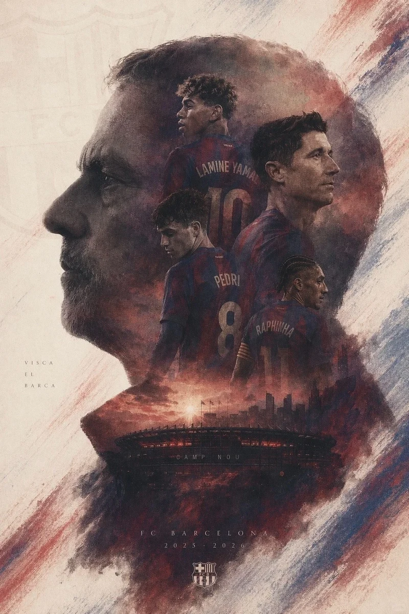 | 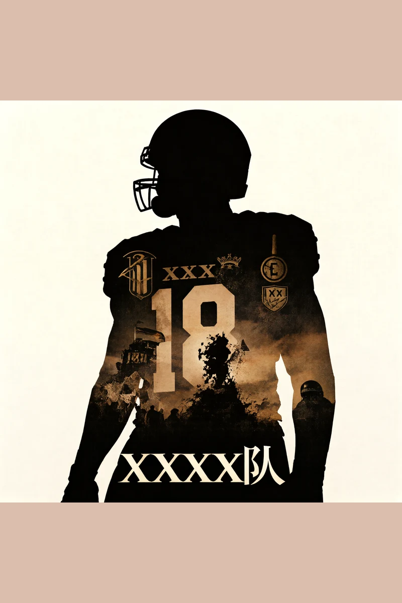 |
| 提示词 | 

GPT-Image-2 案例原提示词（点击展开）
 生成高完成度史诗感艺术海报，双重曝光构图，米白色背景，球队：xxxx队，xxx的大剪影占据主体，剪影内部融合xx、xx、xx、xx以及xx等元素。整体以xx、土褐、为主，压抑、决绝、宿命感极强，元素不要冗杂，要有留白，印刷颗粒质感，元素不要有太锐的细节，但是要有史诗质感，像正式院线动画电影海报，竖版。图片中若出现文字则以细体字为主
 | 

SenseNova 本轮执行提示词（v1，同题）（点击展开）
 生成高完成度史诗感艺术海报，双重曝光构图，米白色背景，球队：xxxx队，xxx的大剪影占据主体，剪影内部融合xx、xx、xx、xx以及xx等元素。整体以xx、土褐、为主，压抑、决绝、宿命感极强，元素不要冗杂，要有留白，印刷颗粒质感，元素不要有太锐的细节，但是要有史诗质感，像正式院线动画电影海报，竖版。图片中若出现文字则以细体字为主
 |
| 复现参数 | 上游案例原图 | seed 1135894708 · 50 步 · balanced · 确定性可复现 |

---
## case-17 · 界面交互设计图（Products & E-commerce）· 上游案例：[来源回链](https://x.com/wory37303852)

| | 左 · GPT-Image-2（参考基线） | 右 · SenseNova-U1.5（复现 v1） |
|---|---|---|
| 效果图 | 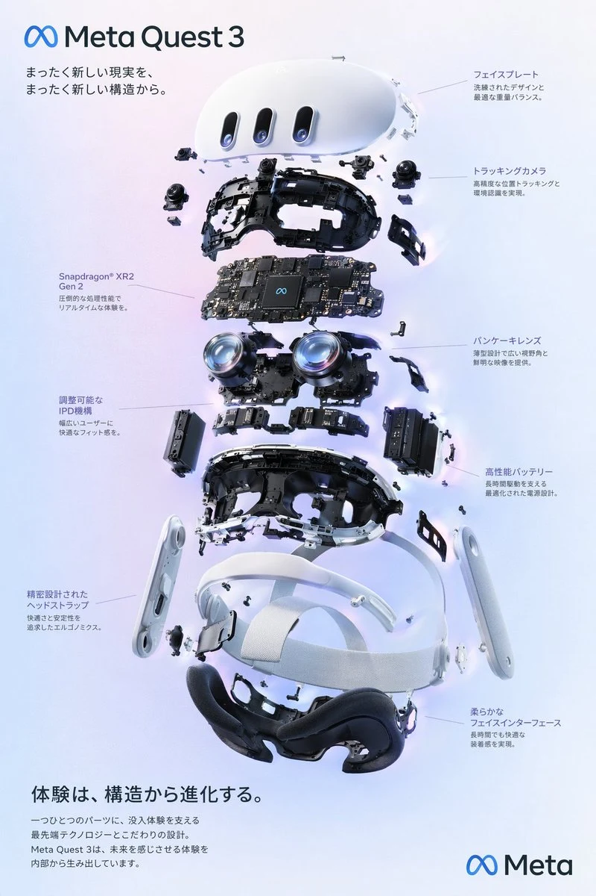 | 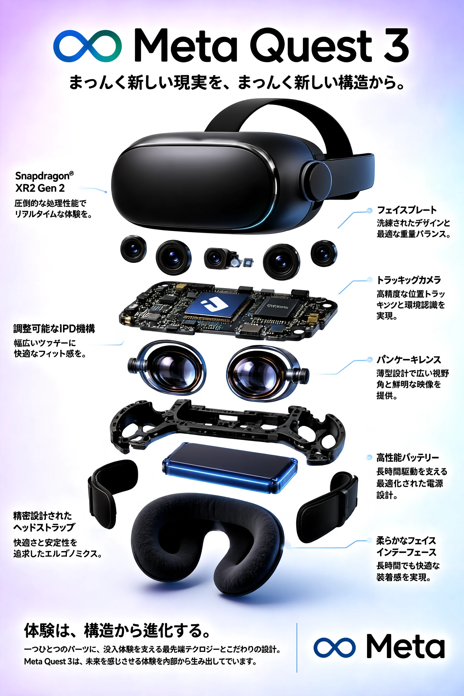 |
| 提示词 | 

GPT-Image-2 案例原提示词（点击展开）
 {   "type": "exploded view product diagram poster",   "subject": "VR headset",   "style": "clean high-tech 3D render, studio lighting, glowing accents",   "background": "{argument name=\"background color\" default=\"soft purple and blue gradient\"}",   "header": {     "logo": "∞ {argument name=\"product name\" default=\"Meta Quest 3\"}",     "subtitle": "{argument name=\"main catchphrase\" default=\"まったく新しい現実を、まったく新しい構造から。\"}"   },   "layout": {     "centerpiece": "vertically stacked exploded view of a VR headset showing 9 distinct layers of internal components: outer shell, camera sensors, motherboard with chip, pancake lenses, internal frame, battery packs, side straps, top strap, and facial interface cushion.",     "callout_labels": {       "count": 8,       "left_side": [         "Snapdragon® XR2 Gen 2\n圧倒的な処理性能でリアルタイムな体験を。",         "調整可能なIPD機構\n幅広いユーザーに快適なフィット感を。",         "精密設計されたヘッドストラップ\n快適さと安定性を追求したエルゴノミクス。"       ],       "right_side": [         "フェイスプレート\n洗練されたデザインと最適な重量バランス。",         "トラッキングカメラ\n高精度な位置トラッキングと環境認識を実現。",         "パンケーキレンズ\n薄型設計で広い視野角と鮮明な映像を提供。",         "高性能バッテリー\n長時間駆動を支える最適化された電源設計。",         "柔らかなフェイスインターフェース\n長時間でも快適な装着感を実現。"       ]     },     "footer": {       "left_text_block": {         "headline": "{argument name=\"bottom headline\" default=\"体験は、構造から進化する。\"}",         "body": "一つひとつのパーツに、没入体験を支える最先端テクノロジーとこだわりの設計。Meta Quest 3は、未来を感じさせる体験を内部から生み出しています。"       },       "right_logo": "∞ Meta"     }   } }
 | 

SenseNova 本轮执行提示词（v1，同题）（点击展开）
 {   "type": "exploded view product diagram poster",   "subject": "VR headset",   "style": "clean high-tech 3D render, studio lighting, glowing accents",   "background": "{argument name=\"background color\" default=\"soft purple and blue gradient\"}",   "header": {     "logo": "∞ {argument name=\"product name\" default=\"Meta Quest 3\"}",     "subtitle": "{argument name=\"main catchphrase\" default=\"まったく新しい現実を、まったく新しい構造から。\"}"   },   "layout": {     "centerpiece": "vertically stacked exploded view of a VR headset showing 9 distinct layers of internal components: outer shell, camera sensors, motherboard with chip, pancake lenses, internal frame, battery packs, side straps, top strap, and facial interface cushion.",     "callout_labels": {       "count": 8,       "left_side": [         "Snapdragon® XR2 Gen 2\n圧倒的な処理性能でリアルタイムな体験を。",         "調整可能なIPD機構\n幅広いユーザーに快適なフィット感を。",         "精密設計されたヘッドストラップ\n快適さと安定性を追求したエルゴノミクス。"       ],       "right_side": [         "フェイスプレート\n洗練されたデザインと最適な重量バランス。",         "トラッキングカメラ\n高精度な位置トラッキングと環境認識を実現。",         "パンケーキレンズ\n薄型設計で広い視野角と鮮明な映像を提供。",         "高性能バッテリー\n長時間駆動を支える最適化された電源設計。",         "柔らかなフェイスインターフェース\n長時間でも快適な装着感を実現。"       ]     },     "footer": {       "left_text_block": {         "headline": "{argument name=\"bottom headline\" default=\"体験は、構造から進化する。\"}",         "body": "一つひとつのパーツに、没入体験を支える最先端テクノロジーとこだわりの設計。Meta Quest 3は、未来を感じさせる体験を内部から生み出しています。"       },       "right_logo": "∞ Meta"     }   } }
 |
| 复现参数 | 上游案例原图 | seed 2141560272 · 50 步 · balanced · 确定性可复现 |

---
## case-22 · 插画艺术风格创作（Illustration & Art）· 上游案例：[来源回链](https://x.com/Tanemomi_Ver2)

| | 左 · GPT-Image-2（参考基线） | 右 · SenseNova-U1.5（复现 v1） |
|---|---|---|
| 效果图 | 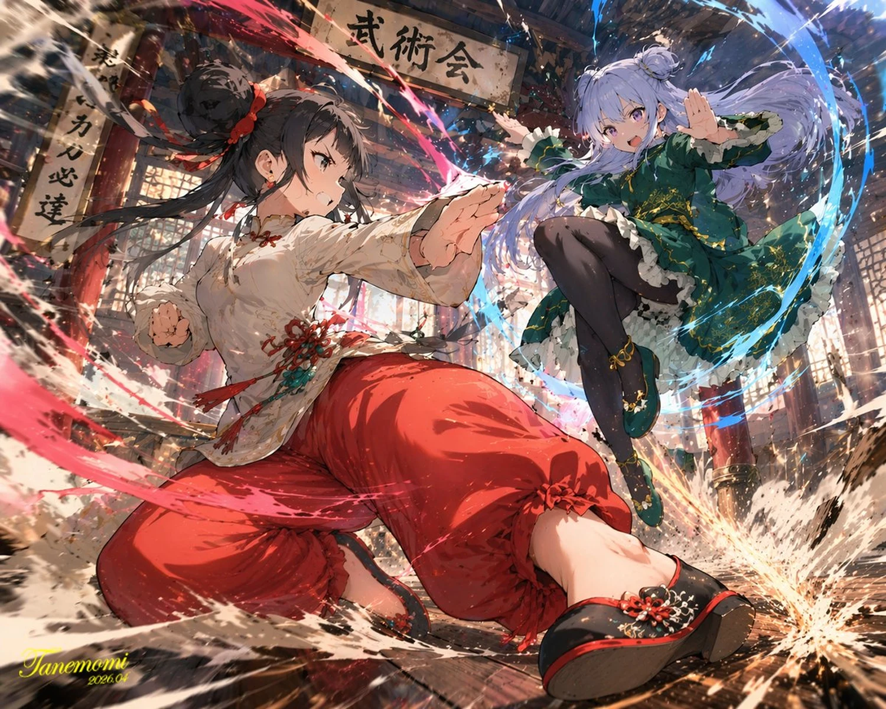 | 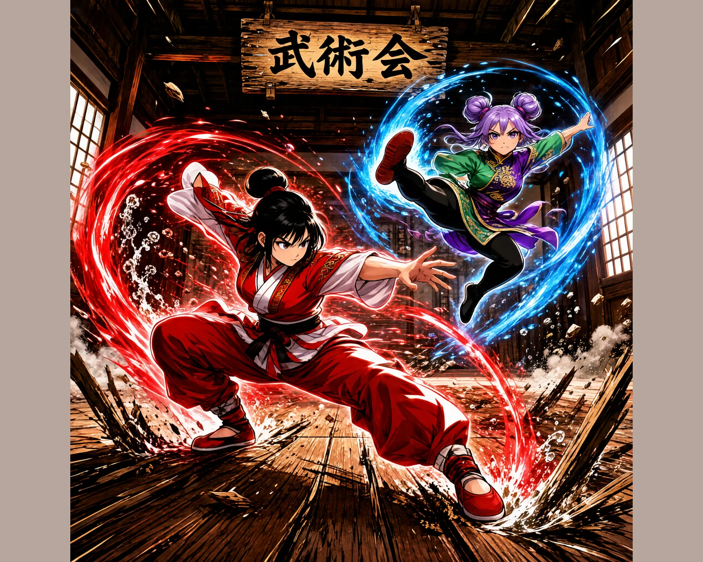 |
| 提示词 | 

GPT-Image-2 案例原提示词（点击展开）
 An anime-style illustration of a {argument name="action type" default="high-impact martial arts battle"} between two young female fighters in a {argument name="setting" default="traditional wooden martial arts dojo"}. In the foreground, a girl with black hair in a high bun wears a {argument name="character 1 color theme" default="red and white"} Chinese-style martial arts outfit with baggy pants. She is in a dynamic, low, forward-thrusting stance, surrounded by swirling red energy and water splashes. In the background to the right, a girl with light purple hair in twin buns wears a {argument name="character 2 color theme" default="green and purple"} Chinese dress with gold embroidery and black tights. She is leaping through the air in a flying kick pose, surrounded by swirling blue energy. The wooden floorboards are splintering from the intense impact, with debris and dust flying through the air. Above them hangs a weathered wooden sign with the text "{argument name="sign text" default="武術会"}". The scene features dramatic lighting, a low-angle dynamic perspective, and intense action effects.
 | 

SenseNova 本轮执行提示词（v1，同题）（点击展开）
 An anime-style illustration of a {argument name="action type" default="high-impact martial arts battle"} between two young female fighters in a {argument name="setting" default="traditional wooden martial arts dojo"}. In the foreground, a girl with black hair in a high bun wears a {argument name="character 1 color theme" default="red and white"} Chinese-style martial arts outfit with baggy pants. She is in a dynamic, low, forward-thrusting stance, surrounded by swirling red energy and water splashes. In the background to the right, a girl with light purple hair in twin buns wears a {argument name="character 2 color theme" default="green and purple"} Chinese dress with gold embroidery and black tights. She is leaping through the air in a flying kick pose, surrounded by swirling blue energy. The wooden floorboards are splintering from the intense impact, with debris and dust flying through the air. Above them hangs a weathered wooden sign with the text "{argument name="sign text" default="武術会"}". The scene features dramatic lighting, a low-angle dynamic perspective, and intense action effects.
 |
| 复现参数 | 上游案例原图 | seed 1620506884 · 50 步 · balanced · 确定性可复现 |

---
## case-25 · 综合应用场景图（Characters & People）· 上游案例：[来源回链](https://x.com/nicdunz)

| | 左 · GPT-Image-2（参考基线） | 右 · SenseNova-U1.5（复现 v1） |
|---|---|---|
| 效果图 | 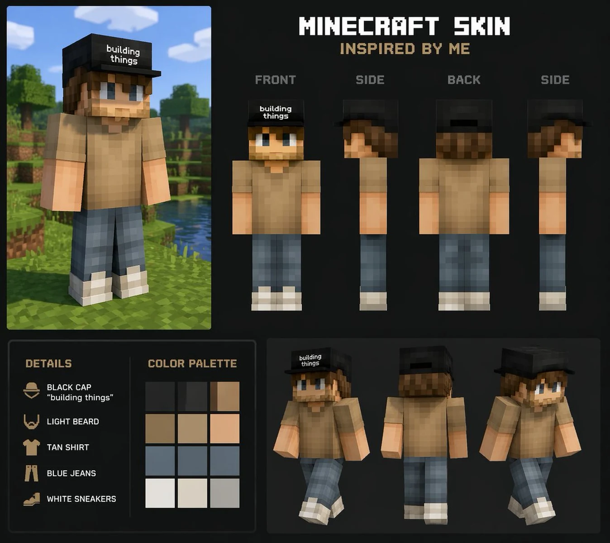 | 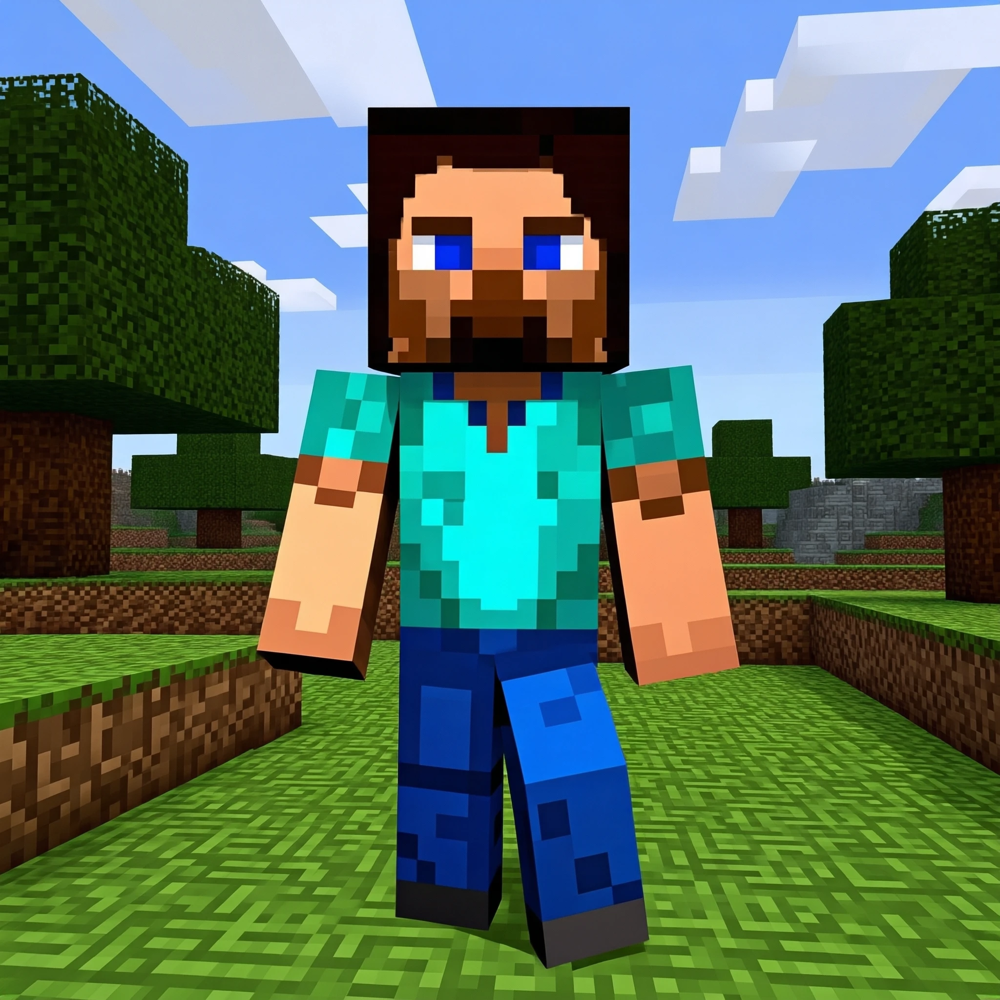 |
| 提示词 | 

GPT-Image-2 案例原提示词（点击展开）
 create a minecraft skin inspired by {argument name="reference" default="my look"}
 | 

SenseNova 本轮执行提示词（v1，同题）（点击展开）
 create a minecraft skin inspired by {argument name="reference" default="my look"}
 |
| 复现参数 | 上游案例原图 | seed 1886652843 · 50 步 · balanced · 确定性可复现 |

---
## case-26 · 建筑空间场景图（Photography & Realism）· 上游案例：[来源回链](https://x.com/ecooai)

| | 左 · GPT-Image-2（参考基线） | 右 · SenseNova-U1.5（复现 v1） |
|---|---|---|
| 效果图 | 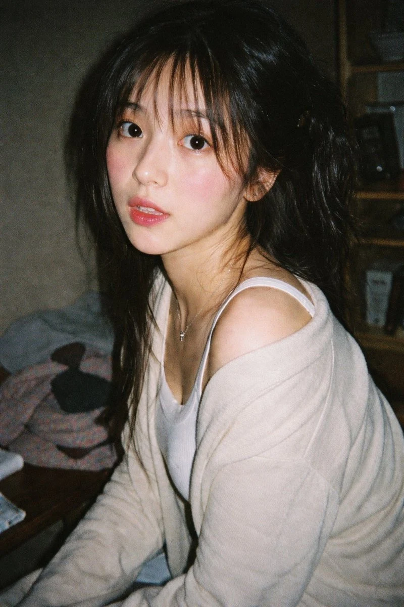 | 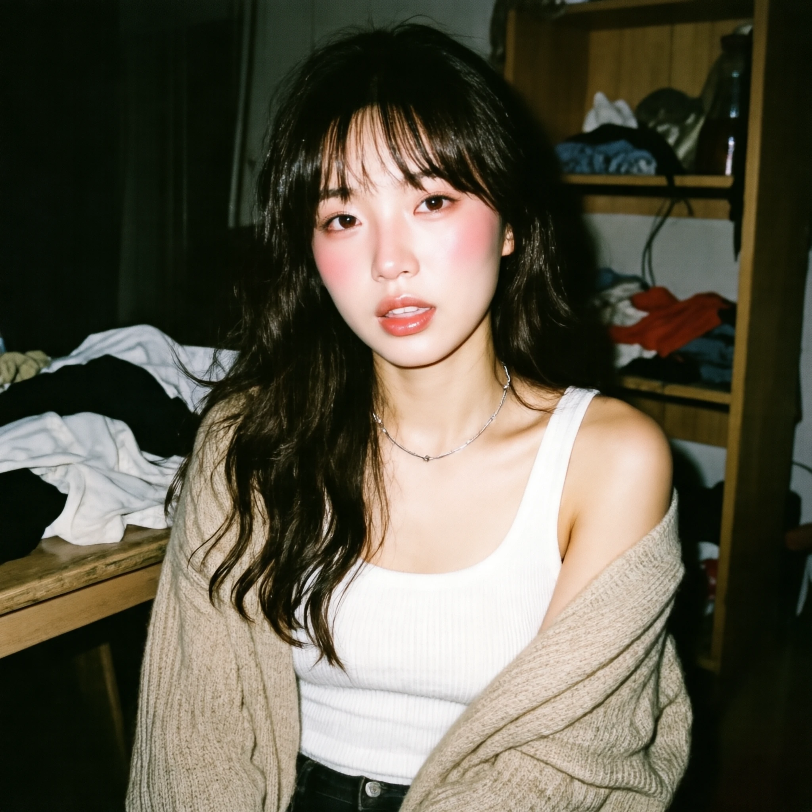 |
| 提示词 | 

GPT-Image-2 案例原提示词（点击展开）
 A vintage 35mm film photograph of a {argument name="subject description" default="young Asian woman"} with {argument name="hair style" default="long dark wavy hair and wispy bangs"}. She is wearing a {argument name="clothing" default="white ribbed tank top and a loose beige knit cardigan slipping off one shoulder"}, along with a delicate silver necklace. She has soft makeup with pink blush and glossy lips, looking directly at the camera with slightly parted lips. The lighting is harsh direct camera flash, creating a candid, amateur snapshot aesthetic. The background is a {argument name="setting" default="dimly lit, slightly messy room with clothes on a table and a wooden shelf"}. The image features heavy film grain, slightly muted colors, and a nostalgic, highly realistic photographic texture.
 | 

SenseNova 本轮执行提示词（v1，同题）（点击展开）
 A vintage 35mm film photograph of a {argument name="subject description" default="young Asian woman"} with {argument name="hair style" default="long dark wavy hair and wispy bangs"}. She is wearing a {argument name="clothing" default="white ribbed tank top and a loose beige knit cardigan slipping off one shoulder"}, along with a delicate silver necklace. She has soft makeup with pink blush and glossy lips, looking directly at the camera with slightly parted lips. The lighting is harsh direct camera flash, creating a candid, amateur snapshot aesthetic. The background is a {argument name="setting" default="dimly lit, slightly messy room with clothes on a table and a wooden shelf"}. The image features heavy film grain, slightly muted colors, and a nostalgic, highly realistic photographic texture.
 |
| 复现参数 | 上游案例原图 | seed 765700029 · 50 步 · balanced · 确定性可复现 |

---
## case-28 · 写实摄影风格创作（Photography & Realism）· 上游案例：[来源回链](https://x.com/frankfu1688)

| | 左 · GPT-Image-2（参考基线） | 右 · SenseNova-U1.5（复现 v1） |
|---|---|---|
| 效果图 | 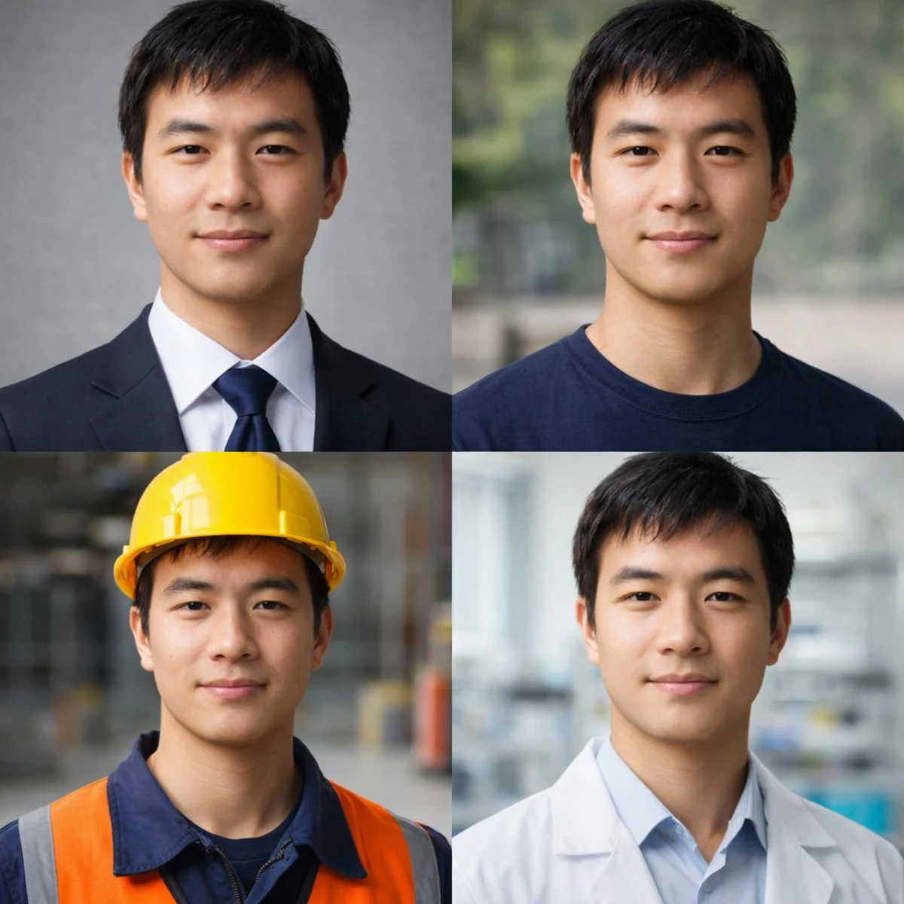 | 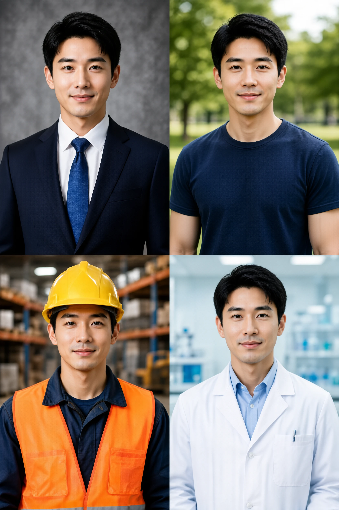 |
| 提示词 | 

GPT-Image-2 案例原提示词（点击展开）
 {   "type": "2x2 portrait grid",   "subject": "{argument name=\"subject description\" default=\"young adult East Asian male with short black hair and a slight smile\"}",   "style": "photorealistic, high-resolution, professional lighting, consistent facial identity across all panels",   "layout": {     "format": "2x2 grid",     "panel_count": 4,     "panels": [       {         "position": "top-left",         "description": "{argument name=\"profession 1\" default=\"Corporate professional wearing a dark navy suit, white shirt, and blue tie against a gray textured background\"}"       },       {         "position": "top-right",         "description": "{argument name=\"profession 2\" default=\"Casual attire wearing a dark blue crew neck t-shirt against a blurred outdoor park background\"}"       },       {         "position": "bottom-left",         "description": "{argument name=\"profession 3\" default=\"Construction worker wearing a yellow hard hat, navy blue work shirt, and bright orange high-visibility vest against a blurred warehouse background\"}"       },       {         "position": "bottom-right",         "description": "{argument name=\"profession 4\" default=\"Medical professional wearing a white lab coat over a light blue collared shirt against a blurred laboratory background\"}"       }     ]   } }
 | 

SenseNova 本轮执行提示词（v1，同题）（点击展开）
 {   "type": "2x2 portrait grid",   "subject": "{argument name=\"subject description\" default=\"young adult East Asian male with short black hair and a slight smile\"}",   "style": "photorealistic, high-resolution, professional lighting, consistent facial identity across all panels",   "layout": {     "format": "2x2 grid",     "panel_count": 4,     "panels": [       {         "position": "top-left",         "description": "{argument name=\"profession 1\" default=\"Corporate professional wearing a dark navy suit, white shirt, and blue tie against a gray textured background\"}"       },       {         "position": "top-right",         "description": "{argument name=\"profession 2\" default=\"Casual attire wearing a dark blue crew neck t-shirt against a blurred outdoor park background\"}"       },       {         "position": "bottom-left",         "description": "{argument name=\"profession 3\" default=\"Construction worker wearing a yellow hard hat, navy blue work shirt, and bright orange high-visibility vest against a blurred warehouse background\"}"       },       {         "position": "bottom-right",         "description": "{argument name=\"profession 4\" default=\"Medical professional wearing a white lab coat over a light blue collared shirt against a blurred laboratory background\"}"       }     ]   } }
 |
| 复现参数 | 上游案例原图 | seed 896924953 · 50 步 · balanced · 确定性可复现 |

---
## case-30 · 写实摄影风格图（Illustration & Art）· 上游案例：[来源回链](https://x.com/opc_8838)

| | 左 · GPT-Image-2（参考基线） | 右 · SenseNova-U1.5（复现 v1） |
|---|---|---|
| 效果图 |  | 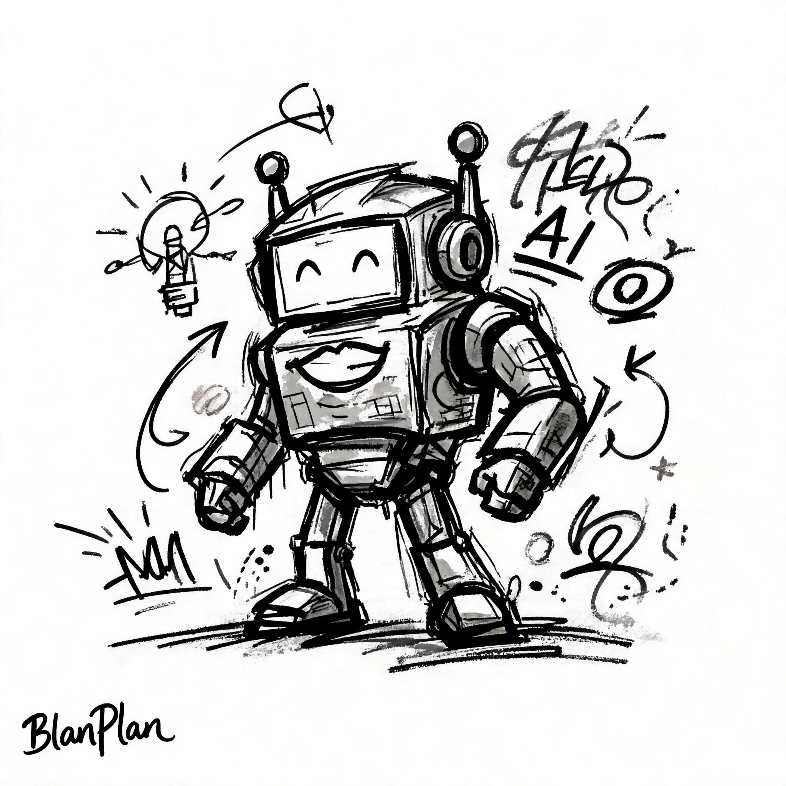 |
| 提示词 | 

GPT-Image-2 案例原提示词（点击展开）
 Express [{argument name="subject" default="a powerful AI builder"}] in a graffiti sketch style, presenting an overall visual effect of rapid sketching, free transformation, improvised hand-drawing, and draft-like qualities. Lines are casual, exaggerated, varied in thickness, slightly messy but rhythmic and expressive, emphasizing generalization, exaggeration, fun, and spontaneity rather than rigorous realism or fine detail. Colors use rough, dry-brush block expressions, retaining uneven smears, brush marks, flying whites, and overlapping feelings. Colors automatically adapt to the [theme/subject], but the overall expression remains graffiti-like, sketch-like, and generalized. No transparent watercolor smudging, no delicate watercolor transitions, no paper textures, no soft atomization, and no dreamlike quality. The background is mainly white space, remaining simple, relaxed, unfinished, and design-oriented. A small amount of auxiliary symbols, arrows, marks, circles, repeated lines, handwritten text, or other graffiti elements can be added to enhance the sketchbook or essay-like visual language, but should not be too crowded or destroy the subject and atmosphere of the white space. The image content does not need to be written in advance; the [{argument name="subject" default="a powerful AI builder"}] will automatically deduce and generate the most suitable main image, actions, related elements, symbols, or simplified scenes. The whole maintains a unified graffiti sketch style and exaggerated generalized expression, avoiding complex realistic backgrounds and over-elaboration. Naturally add a unique signature "{argument name="signature" default="BlanPlan"}" as part of the image, placed discreetly but clearly in the lower-left, lower-right, or near the title. The style should be unified with the overall layout, like an artist's signature or design inscription; the signature font should be refined, restrained, and high-end, not too large, not destructive to the main composition, and not appearing abrupt or cheap.
 | 

SenseNova 本轮执行提示词（v1，同题）（点击展开）
 Express [{argument name="subject" default="a powerful AI builder"}] in a graffiti sketch style, presenting an overall visual effect of rapid sketching, free transformation, improvised hand-drawing, and draft-like qualities. Lines are casual, exaggerated, varied in thickness, slightly messy but rhythmic and expressive, emphasizing generalization, exaggeration, fun, and spontaneity rather than rigorous realism or fine detail. Colors use rough, dry-brush block expressions, retaining uneven smears, brush marks, flying whites, and overlapping feelings. Colors automatically adapt to the [theme/subject], but the overall expression remains graffiti-like, sketch-like, and generalized. No transparent watercolor smudging, no delicate watercolor transitions, no paper textures, no soft atomization, and no dreamlike quality. The background is mainly white space, remaining simple, relaxed, unfinished, and design-oriented. A small amount of auxiliary symbols, arrows, marks, circles, repeated lines, handwritten text, or other graffiti elements can be added to enhance the sketchbook or essay-like visual language, but should not be too crowded or destroy the subject and atmosphere of the white space. The image content does not need to be written in advance; the [{argument name="subject" default="a powerful AI builder"}] will automatically deduce and generate the most suitable main image, actions, related elements, symbols, or simplified scenes. The whole maintains a unified graffiti sketch style and exaggerated generalized expression, avoiding complex realistic backgrounds and over-elaboration. Naturally add a unique signature "{argument name="signature" default="BlanPlan"}" as part of the image, placed discreetly but clearly in the lower-left, lower-right, or near the title. The style should be unified with the overall layout, like an artist's signature or design inscription; the signature font should be refined, restrained, and high-end, not too large, not destructive to the main composition, and not appearing abrupt or cheap.
 |
| 复现参数 | 上游案例原图 | seed 1519636871 · 50 步 · balanced · 确定性可复现 |

---
## case-31 · 人像写实摄影图（Photography & Realism）· 上游案例：[来源回链](https://x.com/jun_kongo)

| | 左 · GPT-Image-2（参考基线） | 右 · SenseNova-U1.5（复现 v1） |
|---|---|---|
| 效果图 | 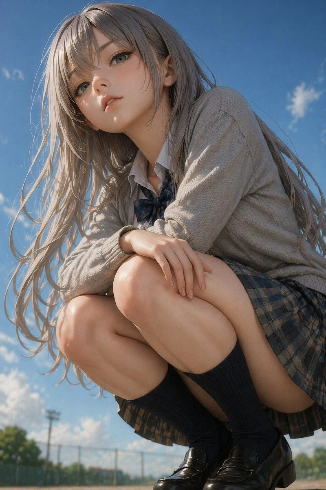 | 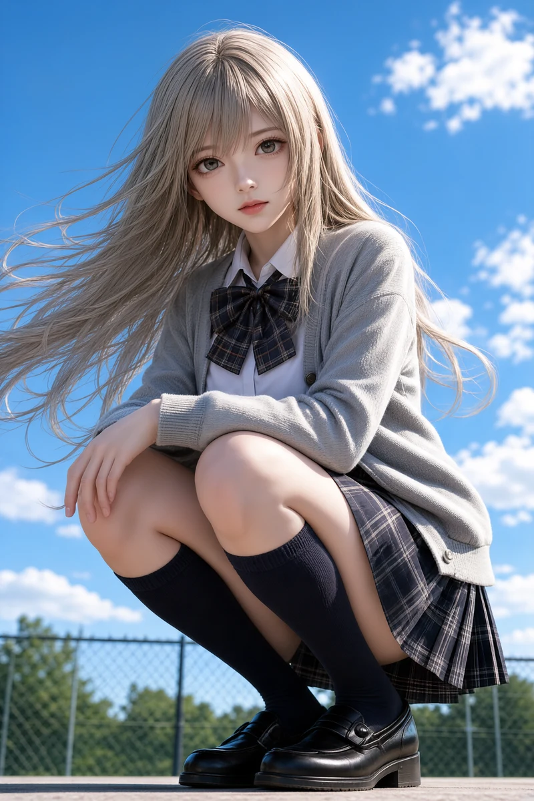 |
| 提示词 | 

GPT-Image-2 案例原提示词（点击展开）
 A highly detailed, photorealistic anime-style portrait of a young woman crouching down and looking slightly down at the camera from a low angle. She has long, flowing {argument name="hair color" default="ash-blonde"} hair blowing gently in the wind, pale skin, and large, expressive eyes. She is wearing a {argument name="outfit" default="Japanese school uniform with a light grey cardigan, white shirt, dark plaid bow tie, dark plaid pleated skirt, dark knee-high socks, and black leather loafers"}. Her arms are resting casually on her knees. The background is a bright {argument name="sky condition" default="clear blue sky with scattered white clouds"}, with a blurred {argument name="background setting" default="chain-link fence and green trees"} visible at the very bottom, suggesting a schoolyard. The lighting is bright, natural daylight with soft, cinematic shadows, emphasizing the realistic textures of her clothing and skin.
 | 

SenseNova 本轮执行提示词（v1，同题）（点击展开）
 A highly detailed, photorealistic anime-style portrait of a young woman crouching down and looking slightly down at the camera from a low angle. She has long, flowing {argument name="hair color" default="ash-blonde"} hair blowing gently in the wind, pale skin, and large, expressive eyes. She is wearing a {argument name="outfit" default="Japanese school uniform with a light grey cardigan, white shirt, dark plaid bow tie, dark plaid pleated skirt, dark knee-high socks, and black leather loafers"}. Her arms are resting casually on her knees. The background is a bright {argument name="sky condition" default="clear blue sky with scattered white clouds"}, with a blurred {argument name="background setting" default="chain-link fence and green trees"} visible at the very bottom, suggesting a schoolyard. The lighting is bright, natural daylight with soft, cinematic shadows, emphasizing the realistic textures of her clothing and skin.
 |
| 复现参数 | 上游案例原图 | seed 1662821900 · 50 步 · balanced · 确定性可复现 |

---
## case-33 · 电商商品展示设计（Products & E-commerce）· 上游案例：[来源回链](https://x.com/yurunekofree)

| | 左 · GPT-Image-2（参考基线） | 右 · SenseNova-U1.5（复现 v1） |
|---|---|---|
| 效果图 | 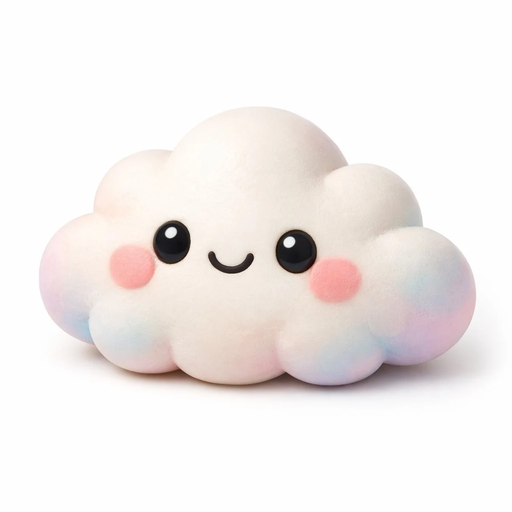 | 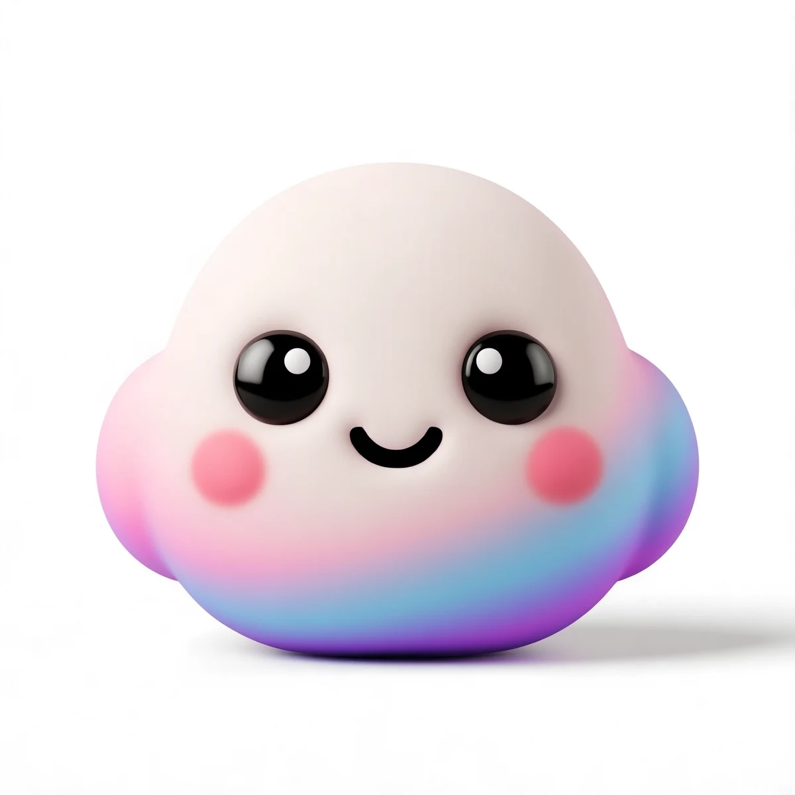 |
| 提示词 | 

GPT-Image-2 案例原提示词（点击展开）
 A 3D render of a cute kawaii {argument name="subject" default="cloud"} character on a pure white background. The character has a soft, matte, squishy texture resembling clay or a stress toy. It features large glossy black eyes with white highlights, a simple curved smile, and round pink blush on its cheeks. The edges and bottom of the figure have a subtle pastel gradient of {argument name="accent colors" default="pink, blue, and purple"}. Soft studio lighting, minimalist icon style, casting a gentle shadow.
 | 

SenseNova 本轮执行提示词（v1，同题）（点击展开）
 A 3D render of a cute kawaii {argument name="subject" default="cloud"} character on a pure white background. The character has a soft, matte, squishy texture resembling clay or a stress toy. It features large glossy black eyes with white highlights, a simple curved smile, and round pink blush on its cheeks. The edges and bottom of the figure have a subtle pastel gradient of {argument name="accent colors" default="pink, blue, and purple"}. Soft studio lighting, minimalist icon style, casting a gentle shadow.
 |
| 复现参数 | 上游案例原图 | seed 728616493 · 50 步 · balanced · 确定性可复现 |

---
## case-35 · 人像写实摄影图（Photography & Realism）· 上游案例：[来源回链](https://x.com/kazmaendo)

| | 左 · GPT-Image-2（参考基线） | 右 · SenseNova-U1.5（复现 v1） |
|---|---|---|
| 效果图 | 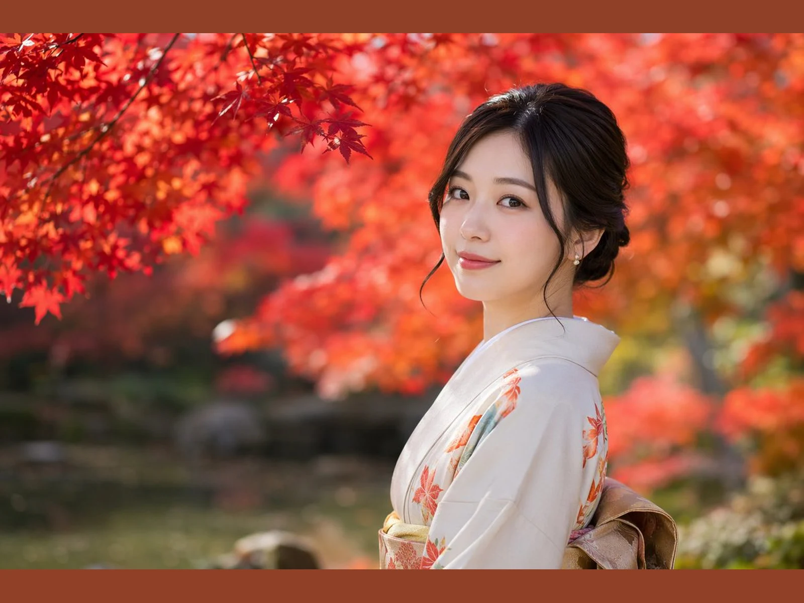 | 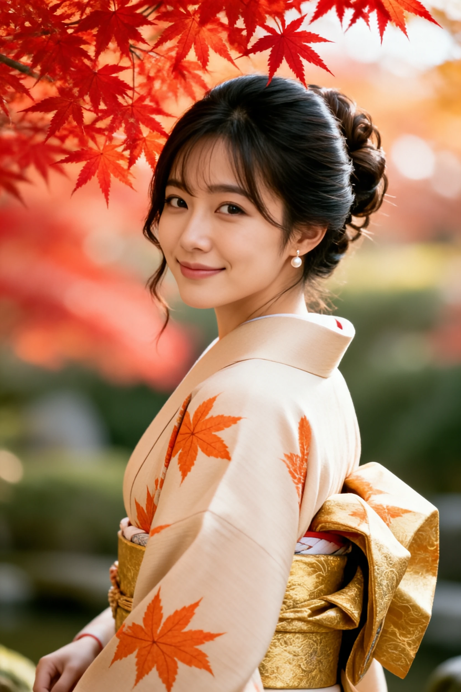 |
| 提示词 | 

GPT-Image-2 案例原提示词（点击展开）
 A {argument name="photography style" default="photorealistic portrait with shallow depth of field and soft bokeh"} of a {argument name="subject" default="young Japanese woman"} looking back over her shoulder at the camera with a {argument name="expression" default="gentle smile"}. She is wearing a {argument name="attire" default="light beige kimono with orange maple leaf patterns"} and a gold obi. Her dark hair is styled in an elegant updo with loose strands framing her face, and she wears small pearl earrings. The background features an {argument name="setting" default="autumn garden with vibrant red maple leaves"}, with bright red foliage framing the top left and a heavily blurred, soft background creating a serene, cinematic atmosphere.
 | 

SenseNova 本轮执行提示词（v1，同题）（点击展开）
 A {argument name="photography style" default="photorealistic portrait with shallow depth of field and soft bokeh"} of a {argument name="subject" default="young Japanese woman"} looking back over her shoulder at the camera with a {argument name="expression" default="gentle smile"}. She is wearing a {argument name="attire" default="light beige kimono with orange maple leaf patterns"} and a gold obi. Her dark hair is styled in an elegant updo with loose strands framing her face, and she wears small pearl earrings. The background features an {argument name="setting" default="autumn garden with vibrant red maple leaves"}, with bright red foliage framing the top left and a heavily blurred, soft background creating a serene, cinematic atmosphere.
 |
| 复现参数 | 上游案例原图 | seed 776465819 · 50 步 · balanced · 确定性可复现 |

---
## case-78 · 图像生成案例图（Other Use Cases）· 上游案例：[来源回链](https://x.com/WOZ1Tx2JZ3kCeBj)

| | 左 · GPT-Image-2（参考基线） | 右 · SenseNova-U1.5（复现 v1） |
|---|---|---|
| 效果图 | 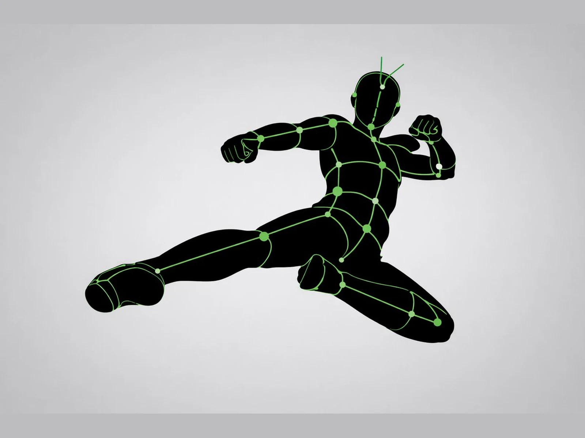 | 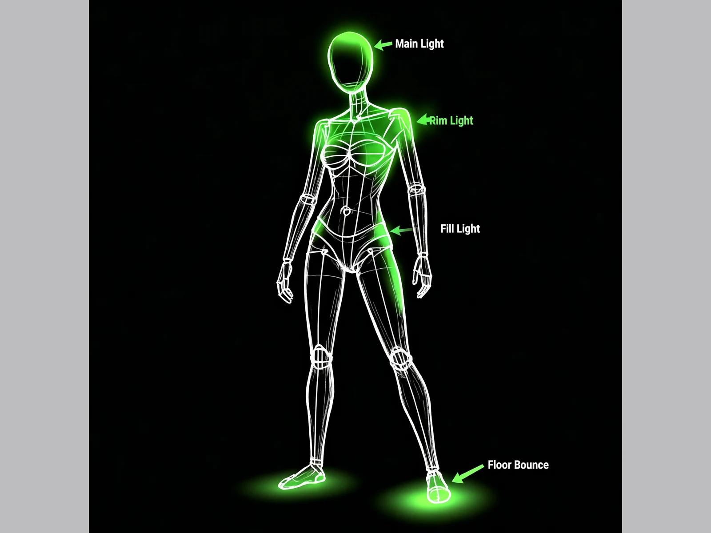 |
| 提示词 | 

GPT-Image-2 案例原提示词（点击展开）
 [CORE TASK] Transform the provided input image into a pose-and-light analysis sheet.  This is NOT a finished character illustration. This is NOT a clothing sheet. This is NOT a beauty-preserving redraw.  This is a white-line rough mannequin conversion.  [PRIMARY GOAL] Extract and visualize only: - pose structure - body balance - camera angle - body line flow - inferred light source placement - illuminated areas and light intensity  [INPUT ROLE] Use the provided image as the strict anchor for: - pose - camera angle - body tilt - weight distribution - approximate lighting situation  Do NOT preserve: - face rendering - hairstyle rendering - clothing detail - accessories - weapon detail - background architecture - character identity - emotional expression  [FIGURE CONVERSION] single rough mannequin-like human figure white body contour lines white internal construction lines simple mannequin head no face no eyes no mouth no eyelashes no personality no individual identity  human figure should look like: - rough pose mannequin - anatomy proxy - line-based body guide - structural sketch - white-line rough dummy  keep: - pose readability - silhouette flow - head tilt - torso direction - pelvis direction - limb placement  [BACKGROUND] pure black background negative-style dark field no scenery no props no architecture no environmental storytelling  [LINE STYLE] rough white line drawing clean but sketch-like construction-line feeling anatomy guide lines visible joint flow visible body contour emphasized no polished illustration finish  [LIGHT ESTIMATION] predict the likely light source positions from the input image visualize the light sources and illuminated areas using green glow only  use green light intensity with variation: - strongest green where the light directly hits - medium green for wrap light - soft green for reflected or fading light  mark the estimated light sources with labels and arrows such as: - Main Light - Rim Light - Fill Light - Floor Bounce - Back Light only if appropriate  IMPORTANT: do not invent random lights infer lighting from the original input image if the lighting is ambiguous, keep the annotations simple and plausible  [GREEN LIGHT VISUALIZATION] show green glow on: - head / skull plane - neck - shoulders - chest plane - ribcage direction - pelvis edge - thigh planes - knee contact points - floor contact bounce if applicable  use green light not as decoration, but as lighting analysis information  [POSE PRIORITY] 1. preserve pose structure 2. preserve camera angle 3. preserve body balance 4. preserve head-torso relationship 5. visualize likely light direction 6. show illuminated areas with readable green intensity variation  [NEGATIVE] finished person, cute girl, detailed face, hair rendering, clothing rendering, weapon emphasis, beautiful anatomy
 | 

SenseNova 本轮执行提示词（v1，同题）（点击展开）
 [CORE TASK] Transform the provided input image into a pose-and-light analysis sheet.  This is NOT a finished character illustration. This is NOT a clothing sheet. This is NOT a beauty-preserving redraw.  This is a white-line rough mannequin conversion.  [PRIMARY GOAL] Extract and visualize only: - pose structure - body balance - camera angle - body line flow - inferred light source placement - illuminated areas and light intensity  [INPUT ROLE] Use the provided image as the strict anchor for: - pose - camera angle - body tilt - weight distribution - approximate lighting situation  Do NOT preserve: - face rendering - hairstyle rendering - clothing detail - accessories - weapon detail - background architecture - character identity - emotional expression  [FIGURE CONVERSION] single rough mannequin-like human figure white body contour lines white internal construction lines simple mannequin head no face no eyes no mouth no eyelashes no personality no individual identity  human figure should look like: - rough pose mannequin - anatomy proxy - line-based body guide - structural sketch - white-line rough dummy  keep: - pose readability - silhouette flow - head tilt - torso direction - pelvis direction - limb placement  [BACKGROUND] pure black background negative-style dark field no scenery no props no architecture no environmental storytelling  [LINE STYLE] rough white line drawing clean but sketch-like construction-line feeling anatomy guide lines visible joint flow visible body contour emphasized no polished illustration finish  [LIGHT ESTIMATION] predict the likely light source positions from the input image visualize the light sources and illuminated areas using green glow only  use green light intensity with variation: - strongest green where the light directly hits - medium green for wrap light - soft green for reflected or fading light  mark the estimated light sources with labels and arrows such as: - Main Light - Rim Light - Fill Light - Floor Bounce - Back Light only if appropriate  IMPORTANT: do not invent random lights infer lighting from the original input image if the lighting is ambiguous, keep the annotations simple and plausible  [GREEN LIGHT VISUALIZATION] show green glow on: - head / skull plane - neck - shoulders - chest plane - ribcage direction - pelvis edge - thigh planes - knee contact points - floor contact bounce if applicable  use green light not as decoration, but as lighting analysis information  [POSE PRIORITY] 1. preserve pose structure 2. preserve camera angle 3. preserve body balance 4. preserve head-torso relationship 5. visualize likely light direction 6. show illuminated areas with readable green intensity variation  [NEGATIVE] finished person, cute girl, detailed face, hair rendering, clothing rendering, weapon emphasis, beautiful anatomy
 |
| 复现参数 | 上游案例原图 | seed 1840940388 · 50 步 · balanced · 确定性可复现 |

---
## case-130 · 界面交互设计图（Brand & Logos）· 上游案例：[来源回链](https://x.com/chi_vc_)

| | 左 · GPT-Image-2（参考基线） | 右 · SenseNova-U1.5（复现 v1） |
|---|---|---|
| 效果图 | 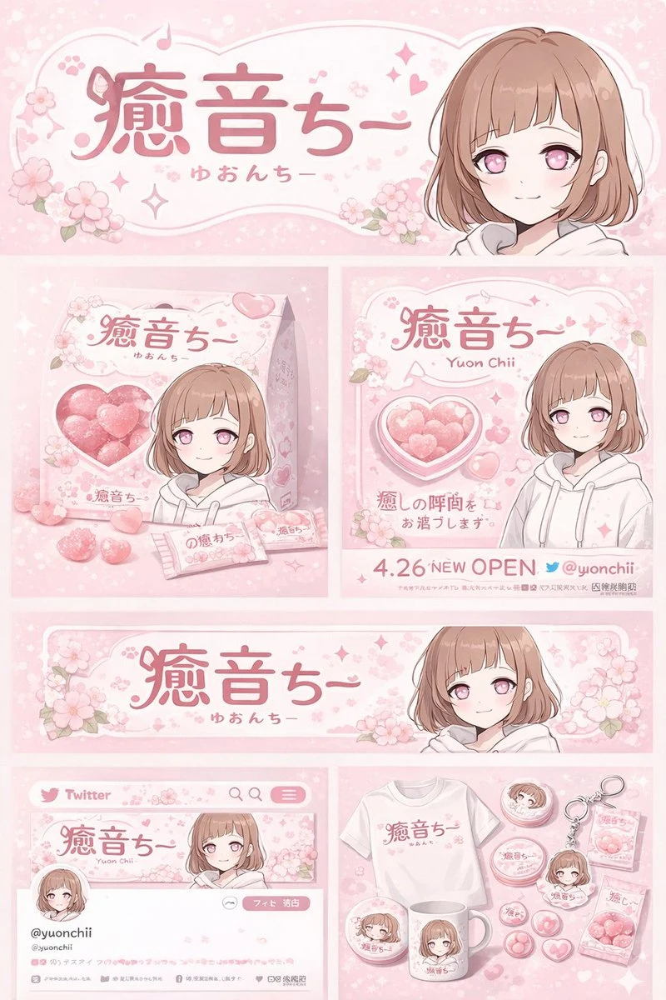 | 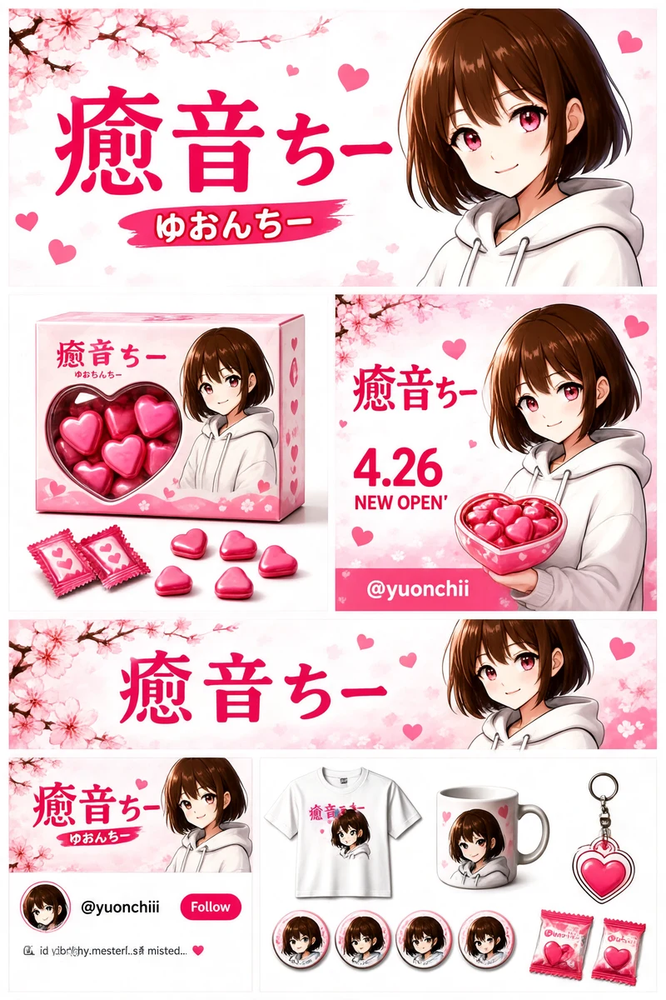 |
| 提示词 | 

GPT-Image-2 案例原提示词（点击展开）
 {   "type": "brand identity and merchandise design board",   "theme": {     "color_palette": "{argument name=\"theme color\" default=\"pastel pink\"} and white",     "motif": "{argument name=\"motif\" default=\"cherry blossoms\"} and pink hearts"   },   "character": {     "description": "anime girl with short brown bob hair, pink eyes, wearing a white hoodie, gentle smile"   },   "branding": {     "main_logo": "{argument name=\"character name\" default=\"癒音ちー\"}",     "sub_logo": "{argument name=\"character subtext\" default=\"ゆおんちー\"}"   },   "layout": {     "sections": [       {         "type": "header banner",         "position": "top",         "elements": ["large main logo", "sub logo", "cherry blossom graphics", "character portrait on the right"]       },       {         "type": "product packaging",         "position": "middle left",         "elements": ["1 square box with heart-shaped transparent window showing pink heart candies", "character illustration on box", "2 individual candy wrappers", "5 scattered heart candies"]       },       {         "type": "promotional poster",         "position": "middle right",         "elements": ["character portrait", "heart-shaped candy bowl", "main logo", "text '4.26 NEW OPEN'", "text '{argument name=\"social handle\" default=\"@yuonchii\"}'"]       },       {         "type": "horizontal web banner",         "position": "lower middle",         "elements": ["main logo", "cherry blossoms", "character portrait on the right"]       },       {         "type": "social media profile mockup",         "position": "bottom left",         "elements": ["header image with logo", "1 circular profile picture", "handle '{argument name=\"social handle\" default=\"@yuonchii\"}'", "1 follow button", "mock bio text"]       },       {         "type": "merchandise collection",         "position": "bottom right",         "count": 9,         "items": ["1 white t-shirt with logo", "1 white mug with character", "4 round pin badges", "1 acrylic keychain", "2 candy packets"]       }     ]   } }
 | 

SenseNova 本轮执行提示词（v1，同题）（点击展开）
 {   "type": "brand identity and merchandise design board",   "theme": {     "color_palette": "{argument name=\"theme color\" default=\"pastel pink\"} and white",     "motif": "{argument name=\"motif\" default=\"cherry blossoms\"} and pink hearts"   },   "character": {     "description": "anime girl with short brown bob hair, pink eyes, wearing a white hoodie, gentle smile"   },   "branding": {     "main_logo": "{argument name=\"character name\" default=\"癒音ちー\"}",     "sub_logo": "{argument name=\"character subtext\" default=\"ゆおんちー\"}"   },   "layout": {     "sections": [       {         "type": "header banner",         "position": "top",         "elements": ["large main logo", "sub logo", "cherry blossom graphics", "character portrait on the right"]       },       {         "type": "product packaging",         "position": "middle left",         "elements": ["1 square box with heart-shaped transparent window showing pink heart candies", "character illustration on box", "2 individual candy wrappers", "5 scattered heart candies"]       },       {         "type": "promotional poster",         "position": "middle right",         "elements": ["character portrait", "heart-shaped candy bowl", "main logo", "text '4.26 NEW OPEN'", "text '{argument name=\"social handle\" default=\"@yuonchii\"}'"]       },       {         "type": "horizontal web banner",         "position": "lower middle",         "elements": ["main logo", "cherry blossoms", "character portrait on the right"]       },       {         "type": "social media profile mockup",         "position": "bottom left",         "elements": ["header image with logo", "1 circular profile picture", "handle '{argument name=\"social handle\" default=\"@yuonchii\"}'", "1 follow button", "mock bio text"]       },       {         "type": "merchandise collection",         "position": "bottom right",         "count": 9,         "items": ["1 white t-shirt with logo", "1 white mug with character", "4 round pin badges", "1 acrylic keychain", "2 candy packets"]       }     ]   } }
 |
| 复现参数 | 上游案例原图 | seed 526527313 · 50 步 · balanced · 确定性可复现 |

---
## case-167 · 大唐玄武门之变的朋友圈（History & Classical Themes）· 上游案例：[来源回链](https://x.com/Tz_2022/status/2046523491940225366)

| | 左 · GPT-Image-2（参考基线） | 右 · SenseNova-U1.5（复现 v1） |
|---|---|---|
| 效果图 | 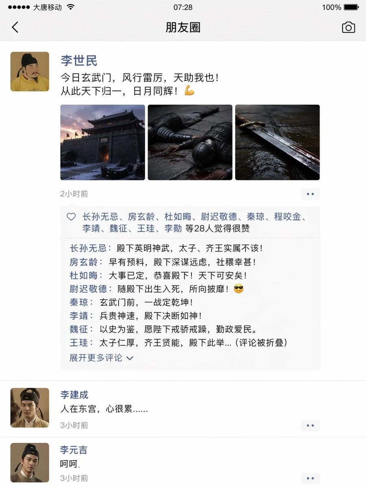 | 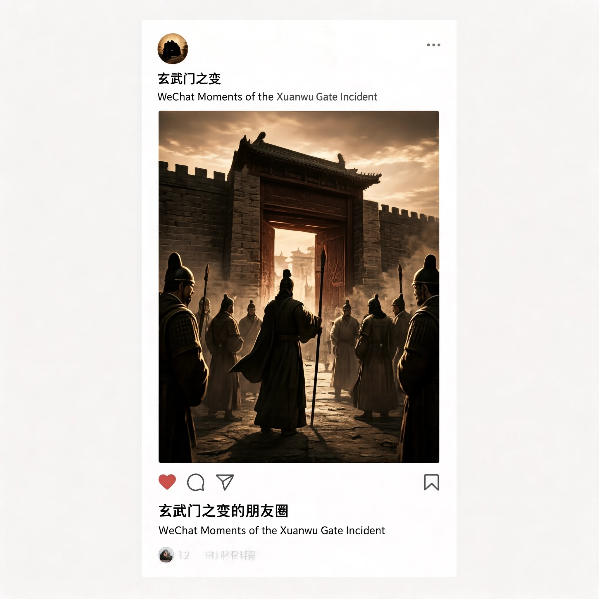 |
| 提示词 | 

GPT-Image-2 案例原提示词（点击展开）
 [中文] 玄武门之变的朋友圈  [English] WeChat Moments of the Xuanwu Gate Incident
 | 

SenseNova 本轮执行提示词（v1，同题）（点击展开）
 [中文] 玄武门之变的朋友圈  [English] WeChat Moments of the Xuanwu Gate Incident
 |
| 复现参数 | 上游案例原图 | seed 405240617 · 50 步 · balanced · 确定性可复现 |

---
## case-174 · 唐朝贵妇遛粉色马甲异形工笔画（History & Classical Themes）· 上游案例：[来源回链](https://x.com/johnAGI168/status/2046565555025367392)

| | 左 · GPT-Image-2（参考基线） | 右 · SenseNova-U1.5（复现 v1） |
|---|---|---|
| 效果图 | 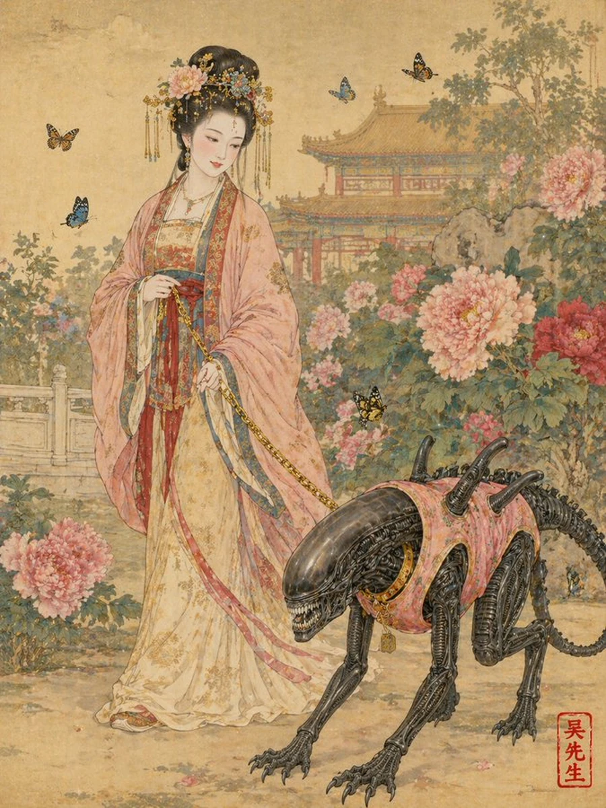 | 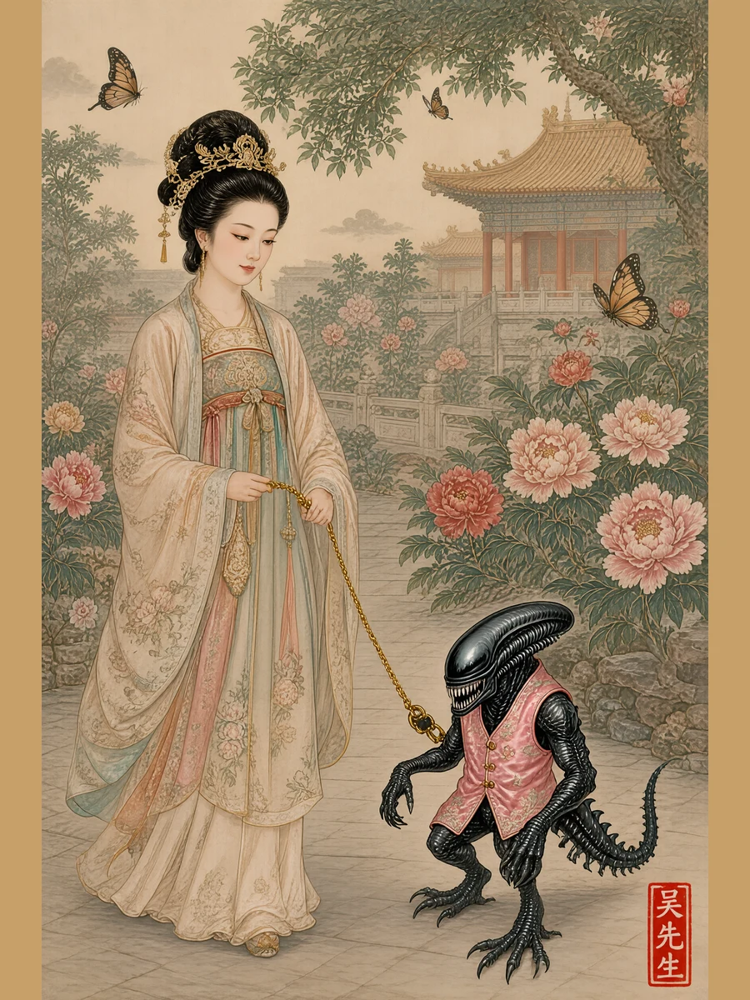 |
| 提示词 | 

GPT-Image-2 案例原提示词（点击展开）
 [中文] 一幅细节丰富的工笔画，描绘了一位唐朝贵族女子在御花园中漫步。她看起来优雅而平静。  她手里拿着一根金色的牵引绳。牵引绳的尽头是一只可怕的**异形怪物（出自电影《异形》）**。然而，这只异形穿着一件**可爱的粉色丝绸马甲**，并且表现得像一只训练有素的狗。  背景有牡丹和蝴蝶。  **在右下角，有一个红色的竖排艺术家印章，写着“吴先生”（Mr. Wu），风格像水印一样。** --ar 3:4  [English] A finely detailed Gongbi painting of a noble Tang Dynasty lady taking a stroll in the imperial garden. She looks elegant and calm.  She is holding a gold leash. At the end of the leash is a terrifying **Xenomorph monster (from the movie Alien)**. However, the Xenomorph is wearing a **cute pink silk vest** and is behaving like a well-trained dog.  Background features peonies and butterflies.  **In the bottom right corner, a single red vertical artist chop seal reads "吴先生" (Mr. Wu), stylized like a watermark.** --ar 3:4
 | 

SenseNova 本轮执行提示词（v1，同题）（点击展开）
 [中文] 一幅细节丰富的工笔画，描绘了一位唐朝贵族女子在御花园中漫步。她看起来优雅而平静。  她手里拿着一根金色的牵引绳。牵引绳的尽头是一只可怕的**异形怪物（出自电影《异形》）**。然而，这只异形穿着一件**可爱的粉色丝绸马甲**，并且表现得像一只训练有素的狗。  背景有牡丹和蝴蝶。  **在右下角，有一个红色的竖排艺术家印章，写着“吴先生”（Mr. Wu），风格像水印一样。** --ar 3:4  [English] A finely detailed Gongbi painting of a noble Tang Dynasty lady taking a stroll in the imperial garden. She looks elegant and calm.  She is holding a gold leash. At the end of the leash is a terrifying **Xenomorph monster (from the movie Alien)**. However, the Xenomorph is wearing a **cute pink silk vest** and is behaving like a well-trained dog.  Background features peonies and butterflies.  **In the bottom right corner, a single red vertical artist chop seal reads "吴先生" (Mr. Wu), stylized like a watermark.** --ar 3:4
 |
| 复现参数 | 上游案例原图 | seed 1240301248 · 50 步 · balanced · 确定性可复现 |

---
## case-182 · 千禧年日系校园喜剧场景（Scenes & Storytelling）· 上游案例：[来源回链](https://x.com/UminekoStudio/status/2046488248256806981)

| | 左 · GPT-Image-2（参考基线） | 右 · SenseNova-U1.5（复现 v1） |
|---|---|---|
| 效果图 | 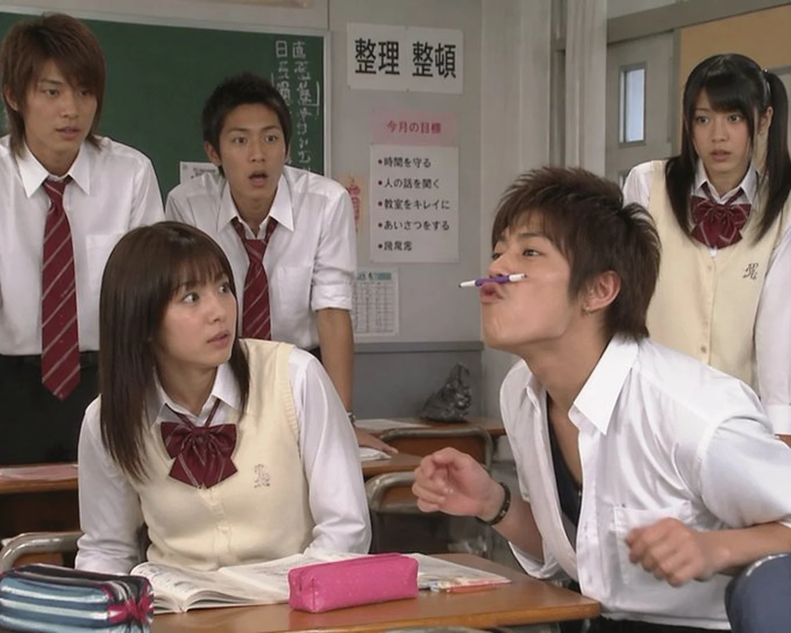 | 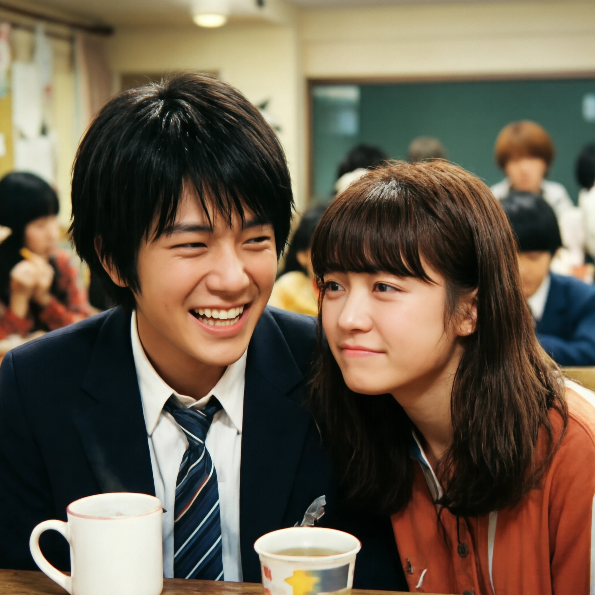 |
| 提示词 | 

GPT-Image-2 案例原提示词（点击展开）
 [中文] 2000 年代面向中学生的日剧喜剧场景  [English] 2000s Japanese TV drama comedy scene aimed at middle school students
 | 

SenseNova 本轮执行提示词（v1，同题）（点击展开）
 [中文] 2000 年代面向中学生的日剧喜剧场景  [English] 2000s Japanese TV drama comedy scene aimed at middle school students
 |
| 复现参数 | 上游案例原图 | seed 1821929173 · 50 步 · balanced · 确定性可复现 |

---
## case-208 · 樱花树下害羞双马尾少女（Scenes & Storytelling）· 上游案例：[来源回链](https://x.com/joshesye/status/2046593124646928397)

| | 左 · GPT-Image-2（参考基线） | 右 · SenseNova-U1.5（复现 v1） |
|---|---|---|
| 效果图 | 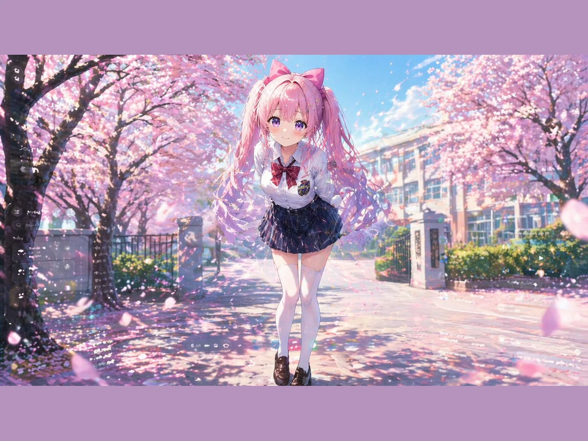 | 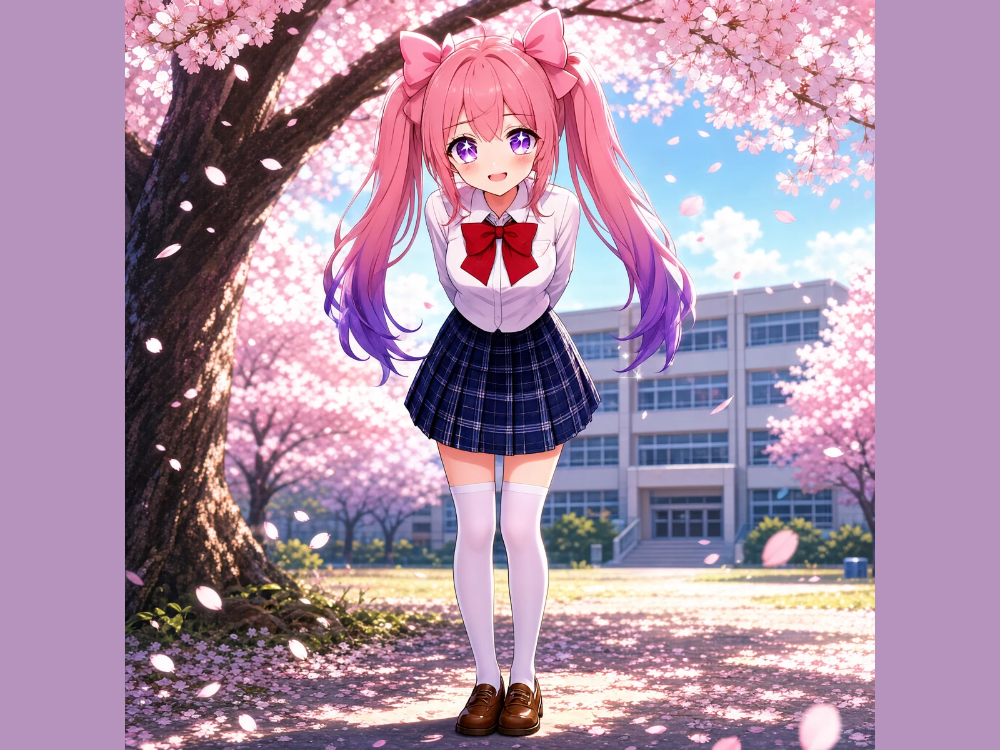 |
| 提示词 | 

GPT-Image-2 案例原提示词（点击展开）
 [中文] 生成一张高质量二次元美少女图片。   角色设定：  - 年龄：17岁 - 发型：双马尾，颜色：樱花粉，发梢带点渐变紫色  - 眼睛：大而明亮，紫色瞳孔，有星星高光  - 服装：JK制服，白色衬衫，深蓝色格子裙，红色领结  - 配饰：白色过膝袜，棕色小皮鞋，头上戴一个粉色蝴蝶结  风格要求：  - 日系动画风格，线条清晰 - 色彩鲜艳，对比度高 - 光影柔和，有层次感 - 背景：樱花树下，花瓣飘落，远处是学校教学楼  表情：微笑，有点害羞 姿势：站姿，双手放在身后，身体微微前倾  比例：16:9（手机壁纸） 质量：8K，超精细，细节丰富  [English] Generate a high-quality anime beautiful girl image.   Character setting:  - Age: 17 years old - Hairstyle: twin tails, color: cherry blossom pink, hair tips with a bit of gradient purple  - Eyes: large and bright, purple pupils, with star highlights  - Clothing: JK uniform, white shirt, dark blue plaid skirt, red bow tie  - Accessories: white over-the-knee socks, brown leather shoes, wearing a pink bow on the head   Style requirements:  - Japanese animation style, clear lines - bright colors, high contrast - soft light and shadow, with a sense of layering - Background: under the cherry blossom tree, petals falling, school teaching building in the distance  Expression: smiling, a bit shy Pose: standing posture, hands placed behind the back, body slightly leaning forward  Proportion: 16:9 (mobile wallpaper) Quality: 8K, ultra-fine, rich in details
 | 

SenseNova 本轮执行提示词（v1，同题）（点击展开）
 [中文] 生成一张高质量二次元美少女图片。   角色设定：  - 年龄：17岁 - 发型：双马尾，颜色：樱花粉，发梢带点渐变紫色  - 眼睛：大而明亮，紫色瞳孔，有星星高光  - 服装：JK制服，白色衬衫，深蓝色格子裙，红色领结  - 配饰：白色过膝袜，棕色小皮鞋，头上戴一个粉色蝴蝶结  风格要求：  - 日系动画风格，线条清晰 - 色彩鲜艳，对比度高 - 光影柔和，有层次感 - 背景：樱花树下，花瓣飘落，远处是学校教学楼  表情：微笑，有点害羞 姿势：站姿，双手放在身后，身体微微前倾  比例：16:9（手机壁纸） 质量：8K，超精细，细节丰富  [English] Generate a high-quality anime beautiful girl image.   Character setting:  - Age: 17 years old - Hairstyle: twin tails, color: cherry blossom pink, hair tips with a bit of gradient purple  - Eyes: large and bright, purple pupils, with star highlights  - Clothing: JK uniform, white shirt, dark blue plaid skirt, red bow tie  - Accessories: white over-the-knee socks, brown leather shoes, wearing a pink bow on the head   Style requirements:  - Japanese animation style, clear lines - bright colors, high contrast - soft light and shadow, with a sense of layering - Background: under the cherry blossom tree, petals falling, school teaching building in the distance  Expression: smiling, a bit shy Pose: standing posture, hands placed behind the back, body slightly leaning forward  Proportion: 16:9 (mobile wallpaper) Quality: 8K, ultra-fine, rich in details
 |
| 复现参数 | 上游案例原图 | seed 509311921 · 50 步 · balanced · 确定性可复现 |
