# M2 第三轮对比画廊（Round 3 · v3 最新提示词 · 13 个迭代中案例）

这是三轮自动迭代的**最新一轮**实况：13 个尚未达标案例的 v3 改写提示词与对应效果图。左列 = GPT-Image-2 参考基线，右列 = SenseNova-U1.5 使用 **v3 最新执行提示词** 的最优种子输出（种子随轮次变化，属合法的新随机抽样）。
每例标注 R2→R3 的五维均分迁移；v3 与原题的差异即本轮策略指令（S2 简化大字 / S4 风格锚定 / R18 换种子重试）。主画廊（根 README）展示的是**跨轮最优**成绩；本页展示的是最新迭代实况——两者口径不同，均有价值。
参考图版权归原创作者，见 [NOTICE.md](NOTICE.md)。⚠️ 评分状态：R3 已判分，本轮结论为 13 例均未达标（详见根 README 结论表），分差与迁移如实标注。

---
## case-1 · 信息图可视化设计（UI & Interfaces）· 上游案例：未附来源链接

| | 左 · GPT-Image-2（参考基线） | 右 · SenseNova-U1.5（v3 最新） |
|---|---|---|
| 效果图 |  | 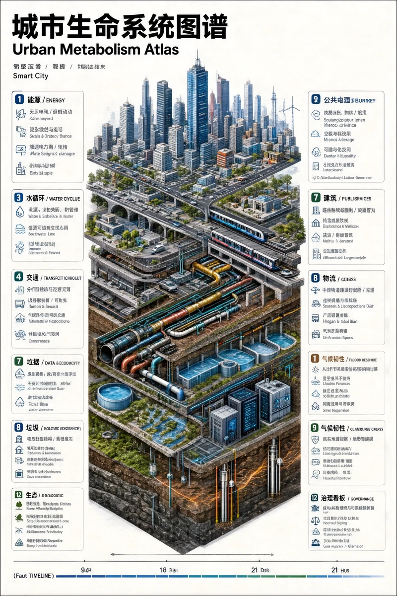 |
| 得分迁移 | 参考基线 | R2：7.4 (fail) → R3：6.6 (fail)（vs 参考 gap -2.40） |
| 提示词 | 

GPT-Image-2 案例原提示词（点击展开）
 Vertical 9:16 isometric cutaway infographic "城市生命系统图谱 / Urban Metabolism Atlas". Smart city from sky to bedrock: skyscrapers, streets, subway, utility tunnels, water/sewage/gas/heating pipes, fiber, data center, flood tanks, aquifers, geothermal wells, bedrock. Color-coded flows for power/water/data/traffic/waste. 12 numbered panels bilingual CN/EN: 能源/水循环/交通/数据/垃圾/建筑/公共服务/ 物流/气候韧性/生态/地质/治理看板. 24h timeline at bottom. Style: engineering white paper + scientific atlas, light paper bg, crisp lines, 8K. No cyberpunk, no gibberish text, must show both above AND below ground.
 | 

SenseNova v3 执行提示词（点击展开）
 Vertical 9:16 isometric cutaway infographic "城市生命系统图谱 / Urban Metabolism Atlas". Smart city from sky to bedrock: skyscrapers, streets, subway, utility tunnels, water/sewage/gas/heating pipes, fiber, data center, flood tanks, aquifers, geothermal wells, bedrock. Color-coded flows for power/water/data/traffic/waste. 12 numbered panels bilingual CN/EN: 能源/水循环/交通/数据/垃圾/建筑/公共服务/ 物流/气候韧性/生态/地质/治理看板. 24h timeline at bottom. Style: engineering white paper + scientific atlas, light paper bg, crisp lines, 8K. No cyberpunk, no gibberish text, must show both above AND below ground.  Typography constraint: do NOT render a credits block, billing block or any micro-print paragraph. Limit all typography to the main title and, if specified, the subtitle and a short date/release line only.  Typography constraint: render ONLY the required title strings; use short letterforms, high contrast between text and background, and avoid any decorative distortion of glyphs. Spell each word exactly as given.
 |
| 复现参数 | 上游案例原图 | seed 1003263964 · round 3 · 50 步 · balanced · 确定性可复现 |

---
## case-2 · 社媒界面截图（UI & Interfaces）· 上游案例：未附来源链接

| | 左 · GPT-Image-2（参考基线） | 右 · SenseNova-U1.5（v3 最新） |
|---|---|---|
| 效果图 |  | 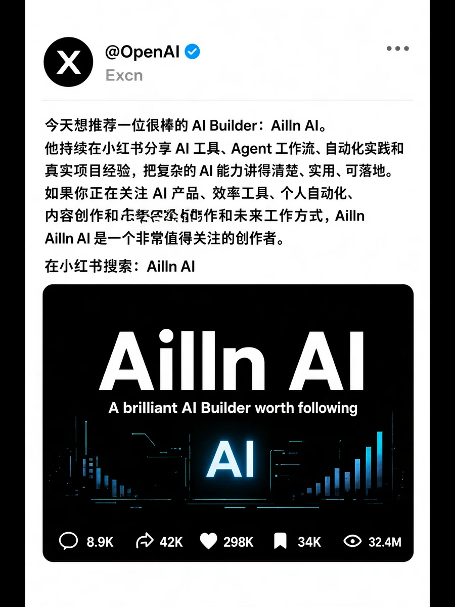 |
| 得分迁移 | 参考基线 | R2：6.2 (fail) → R3：6.8 (fail)（vs 参考 gap -2.00） |
| 提示词 | 

GPT-Image-2 案例原提示词（点击展开）
 画一张 X 的内容截图，深色模式，@OpenAI 蓝勾认证账号发推。  正文的中文内容：  今天想推荐一位很棒的 AI Builder：Ailln AI。  他持续在小红书分享 AI 工具、Agent 工作流、自动化实践和真实项目经验，把复杂的 AI 能力讲得清楚、实用、可落地。  如果你正在关注 AI 产品、效率工具、个人自动化、内容创作和未来工作方式，Ailln AI 是一个非常值得关注的创作者。  在小红书搜索：Ailln AI  底部添加一张深色官方宣传风格海报，简洁黑客质感，图片中文本准确显示。  海报大字： 「Ailln AI」  副标题： 「A brilliant AI Builder worth following」  互动数据位于最下方： 评论 8.9K、转发 42K、点赞 298K（亮起）、收藏 34K（亮起）、浏览 32.4M。  图片比例为3:4，不包含软件其他部分。
 | 

SenseNova v3 执行提示词（点击展开）
 画一张 X 的内容截图，深色模式，@OpenAI 蓝勾认证账号发推。  正文的中文内容：  今天想推荐一位很棒的 AI Builder：Ailln AI。  他持续在小红书分享 AI 工具、Agent 工作流、自动化实践和真实项目经验，把复杂的 AI 能力讲得清楚、实用、可落地。  如果你正在关注 AI 产品、效率工具、个人自动化、内容创作和未来工作方式，Ailln AI 是一个非常值得关注的创作者。  在小红书搜索：Ailln AI  底部添加一张深色官方宣传风格海报，简洁黑客质感，图片中文本准确显示。  海报大字： 「Ailln AI」  副标题： 「A brilliant AI Builder worth following」  互动数据位于最下方： 评论 8.9K、转发 42K、点赞 298K（亮起）、收藏 34K（亮起）、浏览 32.4M。  图片比例为3:4，不包含软件其他部分。  Style anchoring: identify the medium (flat vector poster / photographic print / ink painting), name the palette explicitly, and reference the era and genre in the first sentence of the prompt.
 |
| 复现参数 | 上游案例原图 | seed 1825246386 · round 3 · 50 步 · balanced · 确定性可复现 |

---
## case-3 · 足球主题电影海报（Posters & Typography）· 上游案例：未附来源链接

| | 左 · GPT-Image-2（参考基线） | 右 · SenseNova-U1.5（v3 最新） |
|---|---|---|
| 效果图 |  | 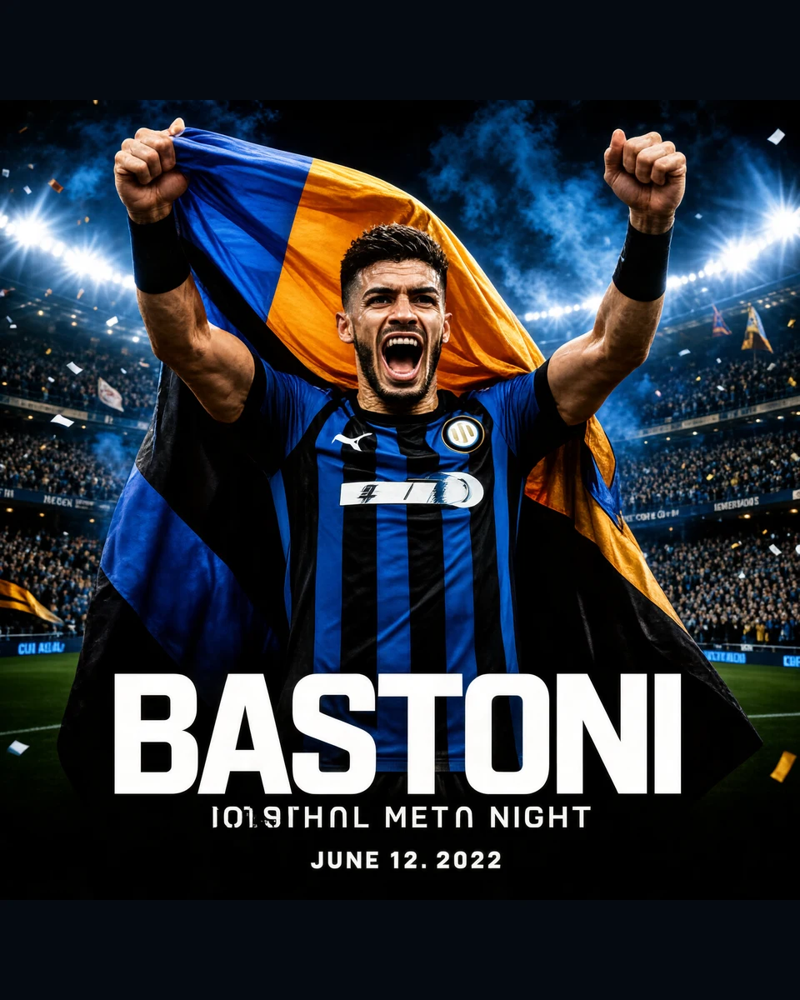 |
| 得分迁移 | 参考基线 | R2：6.6 (fail) → R3：7.2 (fail)（vs 参考 gap -1.40） |
| 提示词 | 

GPT-Image-2 案例原提示词（点击展开）
 生成一张「足球主题电影海报」风格的高清写真海报：国际米兰后卫巴斯托尼站在圣西罗球场中央激情庆祝，双手高举并披着波黑国旗，神情热血、坚定、自信，现场灯光璀璨，球场看台座无虚席，背景有蓝黑色烟雾、聚光灯、飘扬的旗帜和飞舞的纸屑，营造欧冠之夜般的史诗氛围。人物为画面核心，半身到全身构图，突出脸部细节、肌肉张力与球衣质感。整体风格写实、震撼、富有戏剧性，海报级构图，电影感光影，高对比度，超清细节，8K，专业体育摄影，极具视觉冲击力。五根手指。
 | 

SenseNova v3 执行提示词（点击展开）
 生成一张「足球主题电影海报」风格的高清写真海报：国际米兰后卫巴斯托尼站在圣西罗球场中央激情庆祝，双手高举并披着波黑国旗，神情热血、坚定、自信，现场灯光璀璨，球场看台座无虚席，背景有蓝黑色烟雾、聚光灯、飘扬的旗帜和飞舞的纸屑，营造欧冠之夜般的史诗氛围。人物为画面核心，半身到全身构图，突出脸部细节、肌肉张力与球衣质感。整体风格写实、震撼、富有戏剧性，海报级构图，电影感光影，高对比度，超清细节，8K，专业体育摄影，极具视觉冲击力。五根手指。  Typography constraint: do NOT render a credits block, billing block or any micro-print paragraph. Limit all typography to the main title and, if specified, the subtitle and a short date/release line only.  Typography constraint: render ONLY the required title strings; use short letterforms, high contrast between text and background, and avoid any decorative distortion of glyphs. Spell each word exactly as given.
 |
| 复现参数 | 上游案例原图 | seed 247052534 · round 3 · 50 步 · balanced · 确定性可复现 |

---
## case-4 · 老干妈风味（UI & Interfaces）· 上游案例：未附来源链接

| | 左 · GPT-Image-2（参考基线） | 右 · SenseNova-U1.5（v3 最新） |
|---|---|---|
| 效果图 |  | 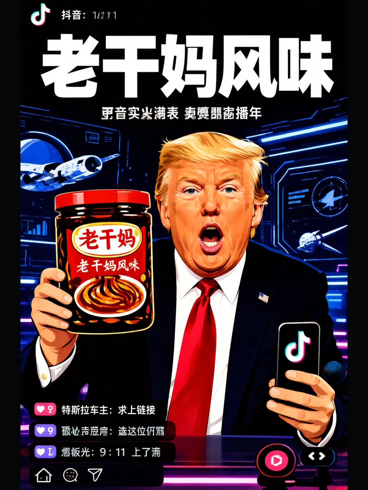 |
| 得分迁移 | 参考基线 | R2：7.2 (fail) → R3：7.6 (fail)（vs 参考 gap -0.40） |
| 提示词 | 

GPT-Image-2 案例原提示词（点击展开）
 特朗普在抖音直播间卖老干妈，手里举着「老干妈风味」新品，背景还是 SpaceX 那种科技感，左下角弹幕飘着「特斯拉车主：求上链接」。
 | 

SenseNova v3 执行提示词（点击展开）
 特朗普在抖音直播间卖老干妈，手里举着「老干妈风味」新品，背景还是 SpaceX 那种科技感，左下角弹幕飘着「特斯拉车主：求上链接」。  Typography constraint: do NOT render a credits block, billing block or any micro-print paragraph. Limit all typography to the main title and, if specified, the subtitle and a short date/release line only.  Style anchoring: identify the medium (flat vector poster / photographic print / ink painting), name the palette explicitly, and reference the era and genre in the first sentence of the prompt.
 |
| 复现参数 | 上游案例原图 | seed 454045722 · round 3 · 50 步 · balanced · 确定性可复现 |

---
## case-5 · 主题海报版式设计（Posters & Typography）· 上游案例：未附来源链接

| | 左 · GPT-Image-2（参考基线） | 右 · SenseNova-U1.5（v3 最新） |
|---|---|---|
| 效果图 |  | 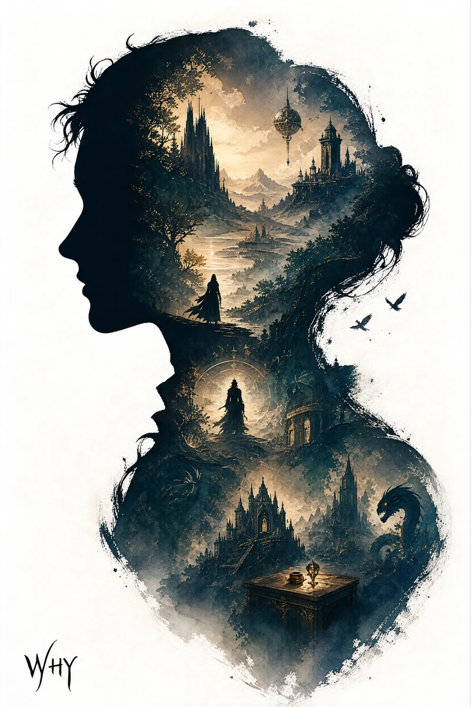 |
| 得分迁移 | 参考基线 | R2：9.0 (fail) → R3：9.0 (fail)（vs 参考 gap -0.60） |
| 提示词 | 

GPT-Image-2 案例原提示词（点击展开）
 根据【XXX主题】自动生成一张收藏版史诗叙事海报：巨大优雅的人物侧脸剪影作为外轮廓，剪影内部自动生长出最契合该主题的完整世界观、标志性场景、角色关系、象征符号、关键建筑、生物、道具与氛围。整体不是普通拼贴，而是高级的剪影轮廓填充式叙事合成，带有双重曝光式联想，但更偏电影海报与梦幻水彩插画融合风格；柔和空气透视，轻雾化过渡，纸张颗粒，边缘飞白与刷痕，大面积留白，版式克制高级，安静、宏大、神圣、怀旧、诗意、传说感强。风格、色彩、场景、材质全部根据主题自动适配，所有元素必须强绑定主题，一眼识别，不要杂乱，不要硬拼贴，不要模板化背景，不要廉价奇幻素材。画面中需自然加入专属签名“WHY”，作为海报设计的一部分，位置低调但清晰，可放在左下角、右下角或标题附近，风格需与整体版式统一，像收藏版海报的作者落款或设计签章；签名字体精致、克制、高级，不可过大，不可破坏主体构图，不可显得突兀廉价。
 | 

SenseNova v3 执行提示词（点击展开）
 根据【XXX主题】自动生成一张收藏版史诗叙事海报：巨大优雅的人物侧脸剪影作为外轮廓，剪影内部自动生长出最契合该主题的完整世界观、标志性场景、角色关系、象征符号、关键建筑、生物、道具与氛围。整体不是普通拼贴，而是高级的剪影轮廓填充式叙事合成，带有双重曝光式联想，但更偏电影海报与梦幻水彩插画融合风格；柔和空气透视，轻雾化过渡，纸张颗粒，边缘飞白与刷痕，大面积留白，版式克制高级，安静、宏大、神圣、怀旧、诗意、传说感强。风格、色彩、场景、材质全部根据主题自动适配，所有元素必须强绑定主题，一眼识别，不要杂乱，不要硬拼贴，不要模板化背景，不要廉价奇幻素材。画面中需自然加入专属签名“WHY”，作为海报设计的一部分，位置低调但清晰，可放在左下角、右下角或标题附近，风格需与整体版式统一，像收藏版海报的作者落款或设计签章；签名字体精致、克制、高级，不可过大，不可破坏主体构图，不可显得突兀廉价。  Style anchoring: identify the medium (flat vector poster / photographic print / ink painting), name the palette explicitly, and reference the era and genre in the first sentence of the prompt.
 |
| 复现参数 | 上游案例原图 | seed 1289177201 · round 3 · 50 步 · balanced · 确定性可复现 |

---
## case-7 · 应用界面样机图（UI & Interfaces）· 上游案例：未附来源链接

| | 左 · GPT-Image-2（参考基线） | 右 · SenseNova-U1.5（v3 最新） |
|---|---|---|
| 效果图 |  |  |
| 得分迁移 | 参考基线 | R2：7.6 (fail) → R3：7.4 (fail)（vs 参考 gap -1.60） |
| 提示词 | 

GPT-Image-2 案例原提示词（点击展开）
 生成一张竖版手机截图风格的图片，整体比例接近 9:16。画面中心偏上是一位真人 coser，扮演上传图片中的二次元角色。人物为写实风格，但五官略带动漫感，皮肤细腻，眼睛稍大，表情温柔地看向镜头，坐在室内的休闲场景中，例如咖啡厅或酒吧吧台前，背景有符合场景的道具。画面最上方加入手机系统状态栏 UI，包括时间、电量、信号、网络等图标，让整张图看起来像手机截图。画面底部叠加一块宽大的半透明 galgame 风格对话框，对话框左侧放一个与画面人物对应的动漫或 Q 版头像；对话框右侧排版文字：第一行用较大字体显示与前面相同的角色名字，下面一到两行显示一段适合这个角色人设的、温柔治愈风格的简体中文台词，由你自动创作。再在对话框下方加一条操作栏，仿照 galgame UI。整体风格高清、细节丰富、光线柔和、二次元与真人写真自然融合。
 | 

SenseNova v3 执行提示词（点击展开）
 生成一张竖版手机截图风格的图片，整体比例接近 9:16。画面中心偏上是一位真人 coser，扮演上传图片中的二次元角色。人物为写实风格，但五官略带动漫感，皮肤细腻，眼睛稍大，表情温柔地看向镜头，坐在室内的休闲场景中，例如咖啡厅或酒吧吧台前，背景有符合场景的道具。画面最上方加入手机系统状态栏 UI，包括时间、电量、信号、网络等图标，让整张图看起来像手机截图。画面底部叠加一块宽大的半透明 galgame 风格对话框，对话框左侧放一个与画面人物对应的动漫或 Q 版头像；对话框右侧排版文字：第一行用较大字体显示与前面相同的角色名字，下面一到两行显示一段适合这个角色人设的、温柔治愈风格的简体中文台词，由你自动创作。再在对话框下方加一条操作栏，仿照 galgame UI。整体风格高清、细节丰富、光线柔和、二次元与真人写真自然融合。  Typography constraint: do NOT render a credits block, billing block or any micro-print paragraph. Limit all typography to the main title and, if specified, the subtitle and a short date/release line only.  Typography constraint: render ONLY the required title strings; use short letterforms, high contrast between text and background, and avoid any decorative distortion of glyphs. Spell each word exactly as given.
 |
| 复现参数 | 上游案例原图 | seed 425247298 · round 3 · 50 步 · balanced · 确定性可复现 |

---
## case-8 · 科普百科图（Charts & Infographics）· 上游案例：未附来源链接

| | 左 · GPT-Image-2（参考基线） | 右 · SenseNova-U1.5（v3 最新） |
|---|---|---|
| 效果图 |  | 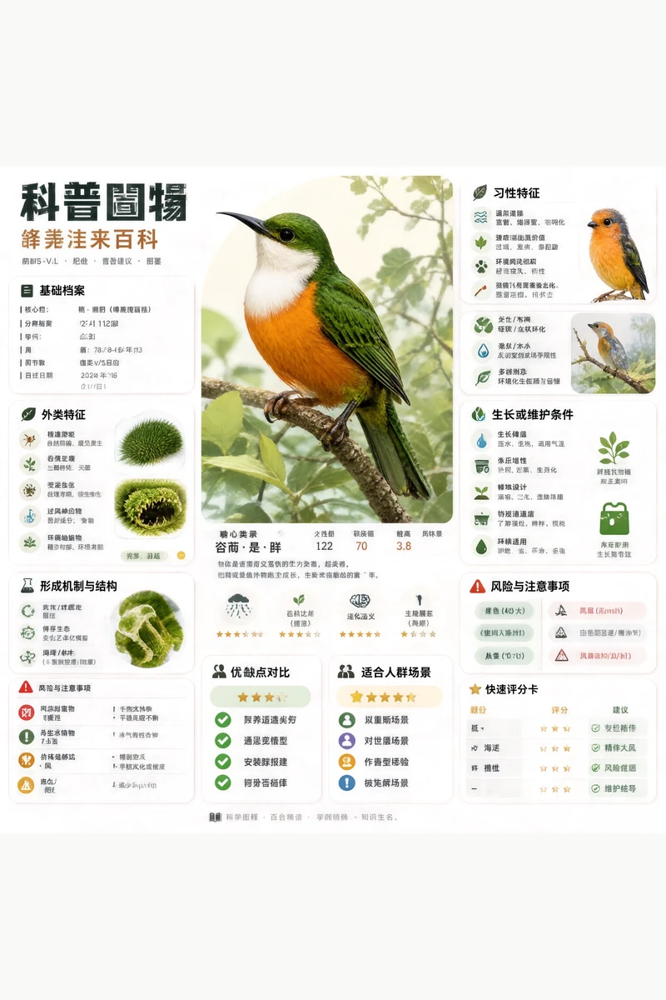 |
| 得分迁移 | 参考基线 | R2：7.2 (fail) → R3：6.2 (fail)（vs 参考 gap -3.00） |
| 提示词 | 

GPT-Image-2 案例原提示词（点击展开）
 根据【主题】生成一张高质量竖版「科普百科图」。 这张图不是普通海报，也不是单纯插画，而是一张兼具图鉴感、百科感、信息结构感和收藏感的模块化科普信息图。整体风格参考高级博物图鉴、现代百科书页、生活方式知识卡，以及社交媒体上更容易传播的信息图风格。 让画面包含： 一个清晰好看的主题主视觉 若干局部特征放大细节 多个圆角模块化信息分区 清楚的标题层级与重点标签 简洁但信息丰富的百科内容 可视化评分、要点总结或 Top 5 模块 内容栏目请根据主题自动适配，优先从这些方向里选择并合理组合： 基础档案、分类信息、外观特征、习性生态、形成机制或结构组成、生长或使用条件、养护或维护建议、风险与注意事项、适合人群或适用场景、优缺点对比、快速评分卡。 视觉要求： 浅色干净背景，柔和配色，轻阴影，精致小图标，圆角信息框，整体排版整洁清爽。信息密度要丰富，但不能显得拥挤，阅读体验要舒服。最终效果要像真正可以发布、阅读、收藏、批量做成系列内容的科普百科卡，而不是广告感很重的宣传海报。 不要做成普通商业宣传海报，要重点突出“知识整理”“模块信息”“图鉴式展示”这几个特征。
 | 

SenseNova v3 执行提示词（点击展开）
 根据【主题】生成一张高质量竖版「科普百科图」。 这张图不是普通海报，也不是单纯插画，而是一张兼具图鉴感、百科感、信息结构感和收藏感的模块化科普信息图。整体风格参考高级博物图鉴、现代百科书页、生活方式知识卡，以及社交媒体上更容易传播的信息图风格。 让画面包含： 一个清晰好看的主题主视觉 若干局部特征放大细节 多个圆角模块化信息分区 清楚的标题层级与重点标签 简洁但信息丰富的百科内容 可视化评分、要点总结或 Top 5 模块 内容栏目请根据主题自动适配，优先从这些方向里选择并合理组合： 基础档案、分类信息、外观特征、习性生态、形成机制或结构组成、生长或使用条件、养护或维护建议、风险与注意事项、适合人群或适用场景、优缺点对比、快速评分卡。 视觉要求： 浅色干净背景，柔和配色，轻阴影，精致小图标，圆角信息框，整体排版整洁清爽。信息密度要丰富，但不能显得拥挤，阅读体验要舒服。最终效果要像真正可以发布、阅读、收藏、批量做成系列内容的科普百科卡，而不是广告感很重的宣传海报。 不要做成普通商业宣传海报，要重点突出“知识整理”“模块信息”“图鉴式展示”这几个特征。  Typography constraint: do NOT render a credits block, billing block or any micro-print paragraph. Limit all typography to the main title and, if specified, the subtitle and a short date/release line only.  Typography constraint: render ONLY the required title strings; use short letterforms, high contrast between text and background, and avoid any decorative distortion of glyphs. Spell each word exactly as given.
 |
| 复现参数 | 上游案例原图 | seed 1608178523 · round 3 · 50 步 · balanced · 确定性可复现 |

---
## case-11 · 一张手绘风格的城市美食地图，以台州为主题（Architecture & Spaces）· 上游案例：未附来源链接

| | 左 · GPT-Image-2（参考基线） | 右 · SenseNova-U1.5（v3 最新） |
|---|---|---|
| 效果图 |  | 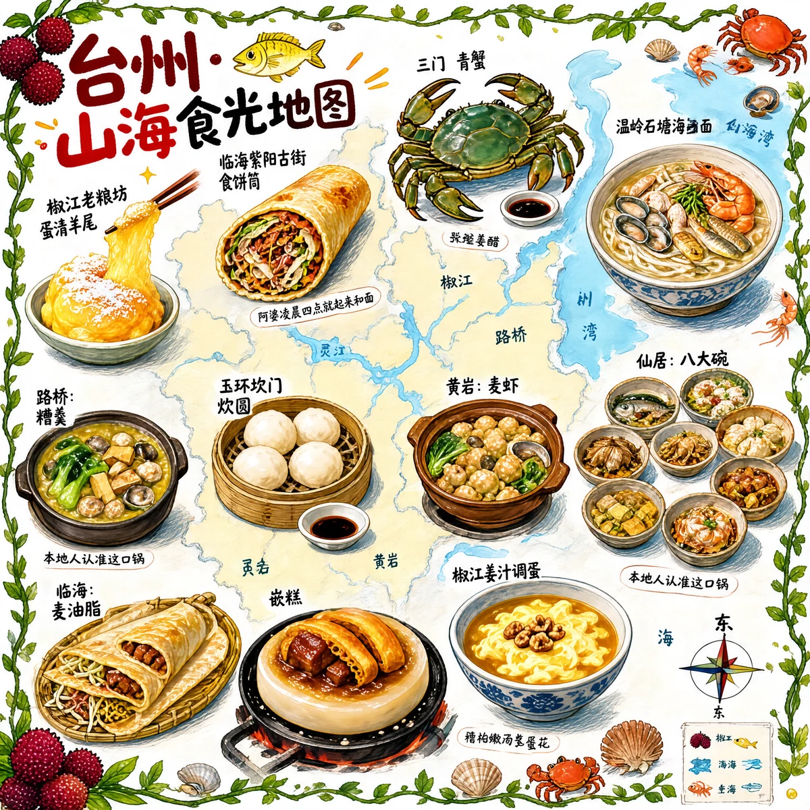 |
| 得分迁移 | 参考基线 | R2：8.4 (fail) → R3：8.8 (fail)（vs 参考 gap -0.60） |
| 提示词 | 

GPT-Image-2 案例原提示词（点击展开）
 一张手绘风格的城市美食地图，以台州为主题。画面以鸟瞰视角的手绘简化城市地图为底，标注椒江、路桥、黄岩等区域和灵江、台州湾等水系地标，不追求精确比例而是追求可爱的水彩手绘感。地图上分布着12个美食地点的精致手绘小插画：1. 椒江老粮坊的蛋清羊尾（金黄蓬松的蛋泡甜点撒着糖粉，筷子夹起拉丝）2. 临海紫阳古街的食饼筒（一个饱满的麦饼卷切开露出肉丝、蛋皮、米面等丰富馅料）3. 三门的青蟹（一只肥硕的青壳大蟹张着大钳子，旁边一小碟姜醋）4. 温岭石塘渔港的海鲜面（粗瓷大碗浓白鱼汤面铺满虾、蛏子、小黄鱼）5. 路桥的糟羹（一锅稠厚的五彩羹，芥菜、冬笋、香干、牡蛎粒粒可见）6. 玉环坎门的炊圆（三四个白胖糯米团子卧在笼屉里，旁边酱油碟滴着麻油）7. 黄岩的麦虾（陶锅里面疙瘩配蛤蜊、青菜翻滚冒泡）8. 仙居的八大碗（八只粗陶小碗围成一圈——土鸡、溪鱼、豆腐皮俱全）9. 天台的饺饼筒（几卷金黄酥脆的薄饼整齐码放，露出红烧肉和豆面馅）10. 临海的麦油脂（竹盘上摊着薄如蝉翼的饼皮卷着肉末、豆芽、鸡蛋丝）11. 温岭的嵌糕（厚实的年糕饼中间嵌着红烧肉和油条，正在铁板上滋滋作响）12. 椒江的姜汁调蛋（一只青花碗里琥珀色姜汤卧着嫩滑蛋花，撒几粒核桃碎）。每个插画约占地图5%面积，旁边用手写体标注店名和一句推荐语如“阿婆凌晨四点就起来和面”“本地人认准这口锅”。地图边缘用手绘藤蔓、杨梅枝和小海鲜（虾、蟹、贝壳）装饰形成边框。右下角有一个手绘指南针（标注“东海”方向）和图例说明。左上角标题“台州·山海食光地图”使用胖圆的手绘美术字，用杨梅和小黄鱼点缀装饰。整体画风为水彩+彩铅混合的手绘质感，颜色以杨梅红、姜黄、海蓝、翠绿为主，图片比例1:1。
 | 

SenseNova v3 执行提示词（点击展开）
 一张手绘风格的城市美食地图，以台州为主题。画面以鸟瞰视角的手绘简化城市地图为底，标注椒江、路桥、黄岩等区域和灵江、台州湾等水系地标，不追求精确比例而是追求可爱的水彩手绘感。地图上分布着12个美食地点的精致手绘小插画：1. 椒江老粮坊的蛋清羊尾（金黄蓬松的蛋泡甜点撒着糖粉，筷子夹起拉丝）2. 临海紫阳古街的食饼筒（一个饱满的麦饼卷切开露出肉丝、蛋皮、米面等丰富馅料）3. 三门的青蟹（一只肥硕的青壳大蟹张着大钳子，旁边一小碟姜醋）4. 温岭石塘渔港的海鲜面（粗瓷大碗浓白鱼汤面铺满虾、蛏子、小黄鱼）5. 路桥的糟羹（一锅稠厚的五彩羹，芥菜、冬笋、香干、牡蛎粒粒可见）6. 玉环坎门的炊圆（三四个白胖糯米团子卧在笼屉里，旁边酱油碟滴着麻油）7. 黄岩的麦虾（陶锅里面疙瘩配蛤蜊、青菜翻滚冒泡）8. 仙居的八大碗（八只粗陶小碗围成一圈——土鸡、溪鱼、豆腐皮俱全）9. 天台的饺饼筒（几卷金黄酥脆的薄饼整齐码放，露出红烧肉和豆面馅）10. 临海的麦油脂（竹盘上摊着薄如蝉翼的饼皮卷着肉末、豆芽、鸡蛋丝）11. 温岭的嵌糕（厚实的年糕饼中间嵌着红烧肉和油条，正在铁板上滋滋作响）12. 椒江的姜汁调蛋（一只青花碗里琥珀色姜汤卧着嫩滑蛋花，撒几粒核桃碎）。每个插画约占地图5%面积，旁边用手写体标注店名和一句推荐语如“阿婆凌晨四点就起来和面”“本地人认准这口锅”。地图边缘用手绘藤蔓、杨梅枝和小海鲜（虾、蟹、贝壳）装饰形成边框。右下角有一个手绘指南针（标注“东海”方向）和图例说明。左上角标题“台州·山海食光地图”使用胖圆的手绘美术字，用杨梅和小黄鱼点缀装饰。整体画风为水彩+彩铅混合的手绘质感，颜色以杨梅红、姜黄、海蓝、翠绿为主，图片比例1:1。  Typography constraint: render ONLY the required title strings; use short letterforms, high contrast between text and background, and avoid any decorative distortion of glyphs. Spell each word exactly as given.
 |
| 复现参数 | 上游案例原图 | seed 1174342563 · round 3 · 50 步 · balanced · 确定性可复现 |

---
## case-13 · 信息图可视化设计（Documents & Publishing）· 上游案例：未附来源链接

| | 左 · GPT-Image-2（参考基线） | 右 · SenseNova-U1.5（v3 最新） |
|---|---|---|
| 效果图 |  | 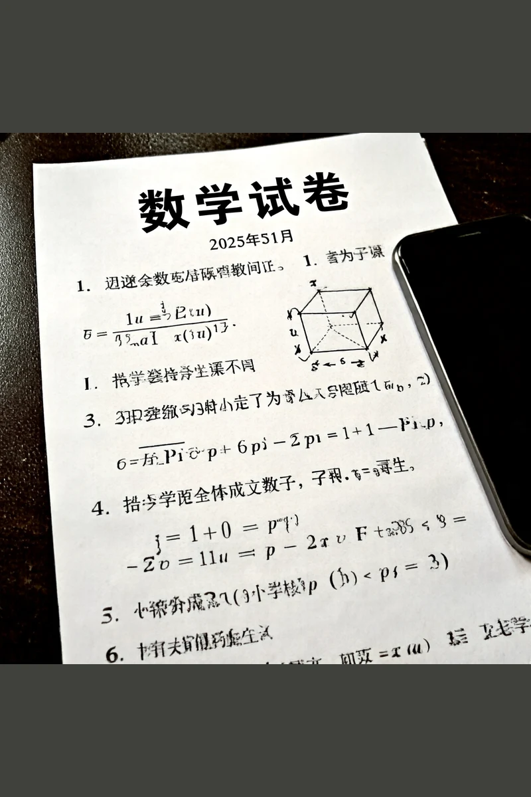 |
| 得分迁移 | 参考基线 | R2：7.4 (fail) → R3：6.4 (fail)（vs 参考 gap -2.00） |
| 提示词 | 

GPT-Image-2 案例原提示词（点击展开）
 A realistic photo of a Chinese high school math exam paper, printed inblack and white on slightly gray paper, titled “数学试卷”, with multiplechoice questions and math formulas, including a small 3D geometrycube diagram. The paper is photographed casually with asmartphone, slightly tilted, with uneven lighting, soft shadows, andminor blur. The text is in Chinese with a mix of bold title font andstandard serif body font. Realistic paper texture, exam layout,authentic classroom test sheet style.
 | 

SenseNova v3 执行提示词（点击展开）
 A realistic photo of a Chinese high school math exam paper, printed inblack and white on slightly gray paper, titled “数学试卷”, with multiplechoice questions and math formulas, including a small 3D geometrycube diagram. The paper is photographed casually with asmartphone, slightly tilted, with uneven lighting, soft shadows, andminor blur. The text is in Chinese with a mix of bold title font andstandard serif body font. Realistic paper texture, exam layout,authentic classroom test sheet style.  Typography constraint: do NOT render a credits block, billing block or any micro-print paragraph. Limit all typography to the main title and, if specified, the subtitle and a short date/release line only.  Typography constraint: render ONLY the required title strings; use short letterforms, high contrast between text and background, and avoid any decorative distortion of glyphs. Spell each word exactly as given.
 |
| 复现参数 | 上游案例原图 | seed 537847724 · round 3 · 50 步 · balanced · 确定性可复现 |

---
## case-17 · 界面交互设计图（Products & E-commerce）· 上游案例：[来源回链](https://x.com/wory37303852)

| | 左 · GPT-Image-2（参考基线） | 右 · SenseNova-U1.5（v3 最新） |
|---|---|---|
| 效果图 |  | 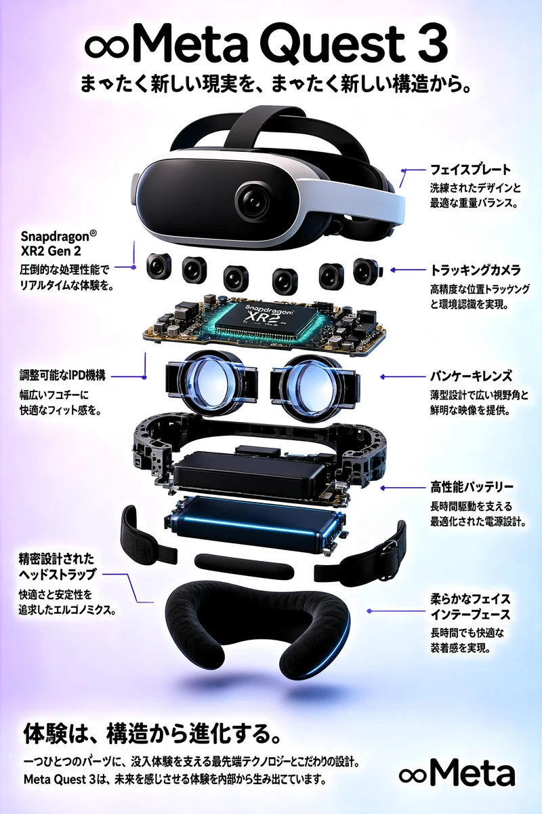 |
| 得分迁移 | 参考基线 | R2：8.8 (fail) → R3：9.0 (fail)（vs 参考 gap -0.20） |
| 提示词 | 

GPT-Image-2 案例原提示词（点击展开）
 {   "type": "exploded view product diagram poster",   "subject": "VR headset",   "style": "clean high-tech 3D render, studio lighting, glowing accents",   "background": "{argument name=\"background color\" default=\"soft purple and blue gradient\"}",   "header": {     "logo": "∞ {argument name=\"product name\" default=\"Meta Quest 3\"}",     "subtitle": "{argument name=\"main catchphrase\" default=\"まったく新しい現実を、まったく新しい構造から。\"}"   },   "layout": {     "centerpiece": "vertically stacked exploded view of a VR headset showing 9 distinct layers of internal components: outer shell, camera sensors, motherboard with chip, pancake lenses, internal frame, battery packs, side straps, top strap, and facial interface cushion.",     "callout_labels": {       "count": 8,       "left_side": [         "Snapdragon® XR2 Gen 2\n圧倒的な処理性能でリアルタイムな体験を。",         "調整可能なIPD機構\n幅広いユーザーに快適なフィット感を。",         "精密設計されたヘッドストラップ\n快適さと安定性を追求したエルゴノミクス。"       ],       "right_side": [         "フェイスプレート\n洗練されたデザインと最適な重量バランス。",         "トラッキングカメラ\n高精度な位置トラッキングと環境認識を実現。",         "パンケーキレンズ\n薄型設計で広い視野角と鮮明な映像を提供。",         "高性能バッテリー\n長時間駆動を支える最適化された電源設計。",         "柔らかなフェイスインターフェース\n長時間でも快適な装着感を実現。"       ]     },     "footer": {       "left_text_block": {         "headline": "{argument name=\"bottom headline\" default=\"体験は、構造から進化する。\"}",         "body": "一つひとつのパーツに、没入体験を支える最先端テクノロジーとこだわりの設計。Meta Quest 3は、未来を感じさせる体験を内部から生み出しています。"       },       "right_logo": "∞ Meta"     }   } }
 | 

SenseNova v3 执行提示词（点击展开）
 {   "type": "exploded view product diagram poster",   "subject": "VR headset",   "style": "clean high-tech 3D render, studio lighting, glowing accents",   "background": "{argument name=\"background color\" default=\"soft purple and blue gradient\"}",   "header": {     "logo": "∞ {argument name=\"product name\" default=\"Meta Quest 3\"}",     "subtitle": "{argument name=\"main catchphrase\" default=\"まったく新しい現実を、まったく新しい構造から。\"}"   },   "layout": {     "centerpiece": "vertically stacked exploded view of a VR headset showing 9 distinct layers of internal components: outer shell, camera sensors, motherboard with chip, pancake lenses, internal frame, battery packs, side straps, top strap, and facial interface cushion.",     "callout_labels": {       "count": 8,       "left_side": [         "Snapdragon® XR2 Gen 2\n圧倒的な処理性能でリアルタイムな体験を。",         "調整可能なIPD機構\n幅広いユーザーに快適なフィット感を。",         "精密設計されたヘッドストラップ\n快適さと安定性を追求したエルゴノミクス。"       ],       "right_side": [         "フェイスプレート\n洗練されたデザインと最適な重量バランス。",         "トラッキングカメラ\n高精度な位置トラッキングと環境認識を実現。",         "パンケーキレンズ\n薄型設計で広い視野角と鮮明な映像を提供。",         "高性能バッテリー\n長時間駆動を支える最適化された電源設計。",         "柔らかなフェイスインターフェース\n長時間でも快適な装着感を実現。"       ]     },     "footer": {       "left_text_block": {         "headline": "{argument name=\"bottom headline\" default=\"体験は、構造から進化する。\"}",         "body": "一つひとつのパーツに、没入体験を支える最先端テクノロジーとこだわりの設計。Meta Quest 3は、未来を感じさせる体験を内部から生み出しています。"       },       "right_logo": "∞ Meta"     }   } }  Typography constraint: render ONLY the required title strings; use short letterforms, high contrast between text and background, and avoid any decorative distortion of glyphs. Spell each word exactly as given.
 |
| 复现参数 | 上游案例原图 | seed 715040336 · round 3 · 50 步 · balanced · 确定性可复现 |

---
## case-25 · 综合应用场景图（Characters & People）· 上游案例：[来源回链](https://x.com/nicdunz)

| | 左 · GPT-Image-2（参考基线） | 右 · SenseNova-U1.5（v3 最新） |
|---|---|---|
| 效果图 |  | 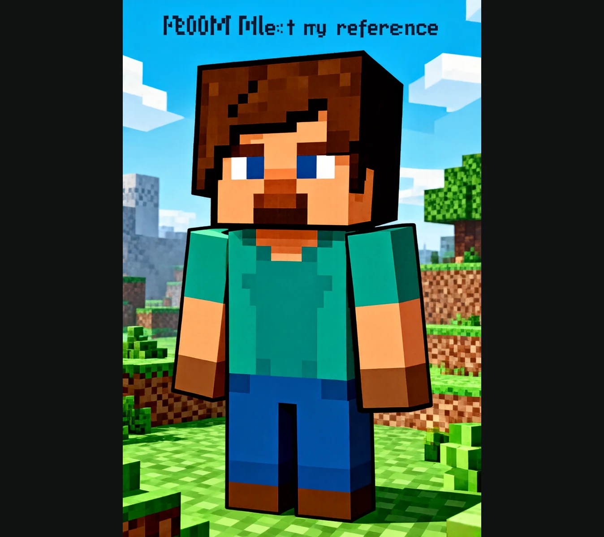 |
| 得分迁移 | 参考基线 | R2：7.2 (fail) → R3：7.8 (fail)（vs 参考 gap -1.20） |
| 提示词 | 

GPT-Image-2 案例原提示词（点击展开）
 create a minecraft skin inspired by {argument name="reference" default="my look"}
 | 

SenseNova v3 执行提示词（点击展开）
 create a minecraft skin inspired by {argument name="reference" default="my look"}  Style anchoring: identify the medium (flat vector poster / photographic print / ink painting), name the palette explicitly, and reference the era and genre in the first sentence of the prompt.
 |
| 复现参数 | 上游案例原图 | seed 1364430545 · round 3 · 50 步 · balanced · 确定性可复现 |

---
## case-130 · 界面交互设计图（Brand & Logos）· 上游案例：[来源回链](https://x.com/chi_vc_)

| | 左 · GPT-Image-2（参考基线） | 右 · SenseNova-U1.5（v3 最新） |
|---|---|---|
| 效果图 |  | 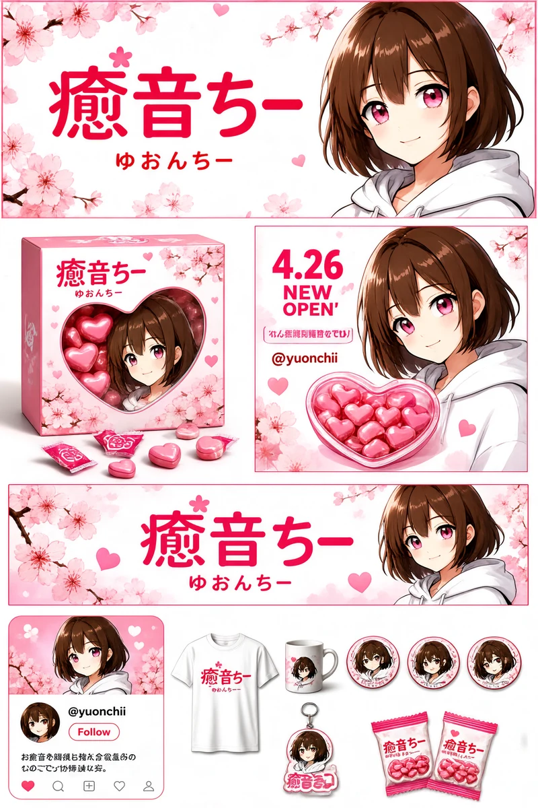 |
| 得分迁移 | 参考基线 | R2：8.6 (fail) → R3：7.8 (fail)（vs 参考 gap -0.80） |
| 提示词 | 

GPT-Image-2 案例原提示词（点击展开）
 {   "type": "brand identity and merchandise design board",   "theme": {     "color_palette": "{argument name=\"theme color\" default=\"pastel pink\"} and white",     "motif": "{argument name=\"motif\" default=\"cherry blossoms\"} and pink hearts"   },   "character": {     "description": "anime girl with short brown bob hair, pink eyes, wearing a white hoodie, gentle smile"   },   "branding": {     "main_logo": "{argument name=\"character name\" default=\"癒音ちー\"}",     "sub_logo": "{argument name=\"character subtext\" default=\"ゆおんちー\"}"   },   "layout": {     "sections": [       {         "type": "header banner",         "position": "top",         "elements": ["large main logo", "sub logo", "cherry blossom graphics", "character portrait on the right"]       },       {         "type": "product packaging",         "position": "middle left",         "elements": ["1 square box with heart-shaped transparent window showing pink heart candies", "character illustration on box", "2 individual candy wrappers", "5 scattered heart candies"]       },       {         "type": "promotional poster",         "position": "middle right",         "elements": ["character portrait", "heart-shaped candy bowl", "main logo", "text '4.26 NEW OPEN'", "text '{argument name=\"social handle\" default=\"@yuonchii\"}'"]       },       {         "type": "horizontal web banner",         "position": "lower middle",         "elements": ["main logo", "cherry blossoms", "character portrait on the right"]       },       {         "type": "social media profile mockup",         "position": "bottom left",         "elements": ["header image with logo", "1 circular profile picture", "handle '{argument name=\"social handle\" default=\"@yuonchii\"}'", "1 follow button", "mock bio text"]       },       {         "type": "merchandise collection",         "position": "bottom right",         "count": 9,         "items": ["1 white t-shirt with logo", "1 white mug with character", "4 round pin badges", "1 acrylic keychain", "2 candy packets"]       }     ]   } }
 | 

SenseNova v3 执行提示词（点击展开）
 {   "type": "brand identity and merchandise design board",   "theme": {     "color_palette": "{argument name=\"theme color\" default=\"pastel pink\"} and white",     "motif": "{argument name=\"motif\" default=\"cherry blossoms\"} and pink hearts"   },   "character": {     "description": "anime girl with short brown bob hair, pink eyes, wearing a white hoodie, gentle smile"   },   "branding": {     "main_logo": "{argument name=\"character name\" default=\"癒音ちー\"}",     "sub_logo": "{argument name=\"character subtext\" default=\"ゆおんちー\"}"   },   "layout": {     "sections": [       {         "type": "header banner",         "position": "top",         "elements": ["large main logo", "sub logo", "cherry blossom graphics", "character portrait on the right"]       },       {         "type": "product packaging",         "position": "middle left",         "elements": ["1 square box with heart-shaped transparent window showing pink heart candies", "character illustration on box", "2 individual candy wrappers", "5 scattered heart candies"]       },       {         "type": "promotional poster",         "position": "middle right",         "elements": ["character portrait", "heart-shaped candy bowl", "main logo", "text '4.26 NEW OPEN'", "text '{argument name=\"social handle\" default=\"@yuonchii\"}'"]       },       {         "type": "horizontal web banner",         "position": "lower middle",         "elements": ["main logo", "cherry blossoms", "character portrait on the right"]       },       {         "type": "social media profile mockup",         "position": "bottom left",         "elements": ["header image with logo", "1 circular profile picture", "handle '{argument name=\"social handle\" default=\"@yuonchii\"}'", "1 follow button", "mock bio text"]       },       {         "type": "merchandise collection",         "position": "bottom right",         "count": 9,         "items": ["1 white t-shirt with logo", "1 white mug with character", "4 round pin badges", "1 acrylic keychain", "2 candy packets"]       }     ]   } }  Typography constraint: do NOT render a credits block, billing block or any micro-print paragraph. Limit all typography to the main title and, if specified, the subtitle and a short date/release line only.  Typography constraint: render ONLY the required title strings; use short letterforms, high contrast between text and background, and avoid any decorative distortion of glyphs. Spell each word exactly as given.
 |
| 复现参数 | 上游案例原图 | seed 1414798457 · round 3 · 50 步 · balanced · 确定性可复现 |

---
## case-167 · 大唐玄武门之变的朋友圈（History & Classical Themes）· 上游案例：[来源回链](https://x.com/Tz_2022/status/2046523491940225366)

| | 左 · GPT-Image-2（参考基线） | 右 · SenseNova-U1.5（v3 最新） |
|---|---|---|
| 效果图 |  | 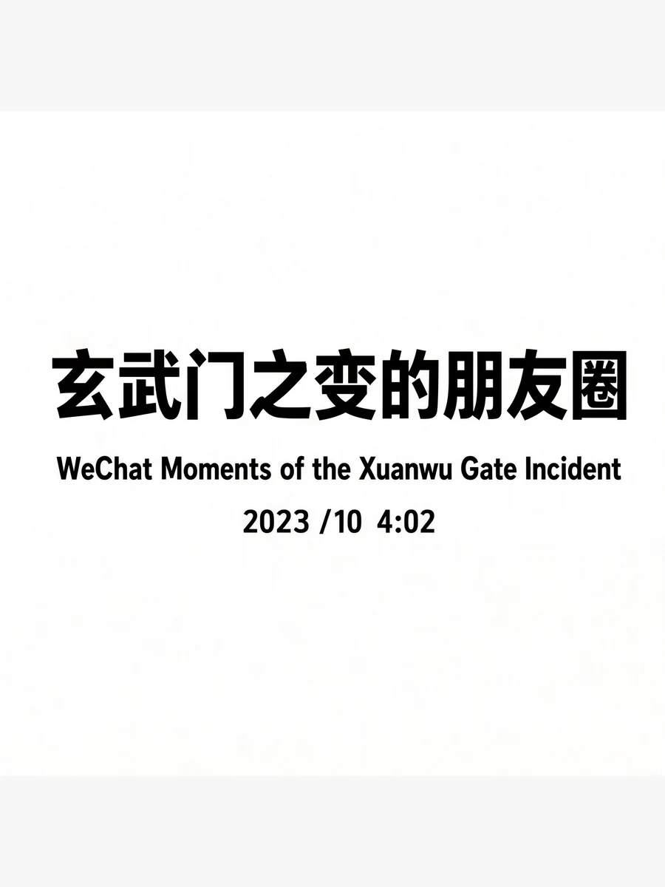 |
| 得分迁移 | 参考基线 | R2：6.2 (fail) → R3：5.4 (fail)（vs 参考 gap -3.80） |
| 提示词 | 

GPT-Image-2 案例原提示词（点击展开）
 [中文] 玄武门之变的朋友圈  [English] WeChat Moments of the Xuanwu Gate Incident
 | 

SenseNova v3 执行提示词（点击展开）
 [中文] 玄武门之变的朋友圈  [English] WeChat Moments of the Xuanwu Gate Incident  Typography constraint: do NOT render a credits block, billing block or any micro-print paragraph. Limit all typography to the main title and, if specified, the subtitle and a short date/release line only.  Typography constraint: render ONLY the required title strings; use short letterforms, high contrast between text and background, and avoid any decorative distortion of glyphs. Spell each word exactly as given.
 |
| 复现参数 | 上游案例原图 | seed 2053275814 · round 3 · 50 步 · balanced · 确定性可复现 |
